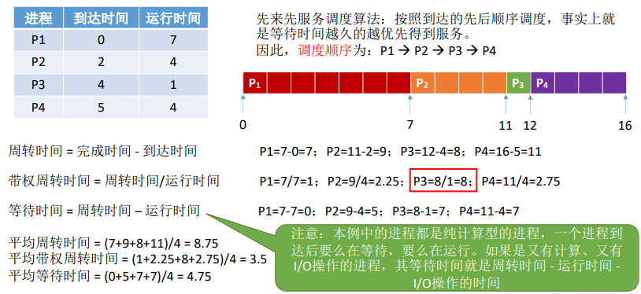
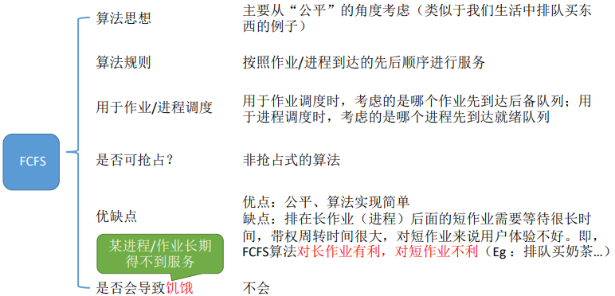

# 操作系统

## 第一章操作系统

### 定义

- 一组能够有效地组织和管理计算机硬件和软件资源，合理的对各类作业进行调度，以及方便用户使用的程序集合

### 目标

1. 方便性
2. 有效性
3. 可扩充性
4. 开放性

### 作用

1. 作为用户与计算机硬件之间的接口
2. 作为计算机系统资源的管理者
3. 实现对计算机资源的抽象

### 发展过程

1.  批处理系统：：用户将作业交给系统操作员，系统操作员将许多用户的作业组成一批作业，之后输入到计算机中，在系统中形成一个自动转接的连续的作业流，然后启动操作系统，系统自动、依次执行每个作业。最后由操作员将作业结果交给用户。
1.  单道批处理系统：系统对作业的处理是成批进行的，但内存中始终保持一道作业。该系统是在解决人机矛盾和 CPU 与 I/O 设备速率不匹配的矛盾中形成的。

    - 顺序性：磁带上的各道作业是顺序地进入内存，各道作业的完成顺序与它们进入内存的顺序，在正常情况下应完全相同，亦即先调入内存的作业先完成。
    - 单道性：内存中仅有一道程序运行，即监督程序每次从磁带上只调入一道程序进入内存运行，当该程序完成或发生异常情况时，才换入其后继程序进入内存运行。
    - 自动性：在顺利的情况下，在磁带上的一批作业能自动地逐个依次运行，而无需人工干预。

    2. 多道批处理系统：多道程序设计技术允许多个程序同时进入内存并运行。即同时把多个程序放入内存，并允许它们交替在 CPU 中运行，它们共享系统中的各种硬、软件资源。当一道程序因 I/O 请求而暂停运行时，CPU 便立即转去运行另一道程序。它没有用某些机制提高某一技术方面的瓶颈问题，而是让系统的各个组成部分都尽量去“忙”，花费很少时间去切换任务，达到了系统各部件之间的并行工作，使其整体在单位时间内的效率翻倍。

       - 多道：计算机内存中同时存放多道相互独立的程序。
       - 宏观上并行：同时进入系统的多道程序都处于运行过程中，即它们先后开始了各自的运行，但都未运行完毕。
       - 微观上串行：内存中的多道程序轮流占有 CPU，交替执行。
       - 优点：资源利用率高，系统吞吐量大
       - 缺点：平均周转时间长，无交互能力
       - 需要解决的问题：

         - 处理机争用问题

       - 内存分配和保护问题
         - I/O 设备分配问题
       - 文件组织和管理问题
         - 作业管理问题
       - 用户与系统的接口问题

1.                 分时操作系统：一台主机连接了若干个终端，每个终端有一个用户在使用。用户交互式地向系统提出命令请求，系统接受每个用户的命令，采用时间片轮转方式处理服务请求，并通过交互方式在终端上向用户显示结果。用户根据上步结果发出下道命。分时操作系统将CPU的时间划分成若干个片段，称为时间片。操作系统以时间片为单位，轮流为每个终端用户服务。每个用户轮流使用一个时间片而使每个用户并不感到有别的用户存在。分时系统具有多路性、交互性、“独占”性和及时性的特征。多路性指，伺时有多个用户使用一台计算机，宏观上看是多个人同时使用一个CPU，微观上是多个人在不同时刻轮流使用CPU。交互性是指，用户根据系统响应结果进一步提出新请求(用户直接干预每一步)。“独占”性是指，用户感觉不到计算机为其他人服务，就像整个系统为他所独占。及时性指，系统对用户提出的请求及时响应。

    - 特点：
      - 多路性（同时性）：指允许多个终端用户同时使用一台计算机，即一台计算机与若干台终端相连接，终端上的这些用户可以同时或基本同时使用计算机。
      - 交互性：用户能够方便地与系统进行人-机对话，即用户通过终端釆用人 4^1 对话的方式直接控制程序运行，与同程序进行交互。
      - 独立性：系统中多个用户可以彼此独立地进行操作，互不干扰，单个用户感觉不到别人也在使用这台计算机，好像只有自己单独使用这台计算机一样。
      - 及时性：用户请求能在很短时间内获得响应。分时系统釆用时间片轮转方式使一台计算机同时为多个终端服务，使用户能够对系统的及时响应感到满意。
      - 解决了人机交互问题

1.  实时操作系统：实时操作系统是指使计算机能及时响应外部事件的请求在规定的严格时间内完成对该事件的处理，并控制所有实时设备和实时任务协调一致地工作的操作系统。实时操作系统要追求的目标是：对外部请求在严格时间范围内做出反应，有高可靠性和完整性。

### 操作系统的基本特点

1. 并发与并行
   1. 并行：两个或多个事件在同一时刻发生
   2. 并发：两个或多个事件在同一时间间隔发生
   - 并发是提高系统资源利用率，增加系统的吞吐量的主要手段
   - 单处理机并发执行，多处理机并发/并行执行
   - 引入进程机制可以实现多进程并发执行
2. 共享：资源共享也称为资源复用，是指操作系统中的资源可以供内存中多个并发执行的进程共同使用

   1. 互斥共享方式：临界资源（独占资源）
   2. 同时访问方式：磁盘，共享代码……

3. 虚拟：通过某种技术将一个物理实体变为若干个逻辑上的对应物的功能

   1. 时分复用：虚拟处理机（多道程序）技术
   2. 空分复用：多到程序共享内存

4. 异步

   1. 在多道程序环境下，系统允许多个进程并发执行
   2. 由于对系统资源的竞争以及进程调度顺序不同，进程总是走走停停
   3. 进程以人们不可知的速度向前推进，这就是进程的异步性

### 操作系统的主要功能

1. 处理机管理
   1. 主要任务：是对处理机进行分配并对其运行实施有效管理。对处理机的管理，可归结为对进程的管理。
   2. 功能
      - 进程控制：创建、撤销以及进程状态转换。线程的管理
      - 进程同步：
        - 进程互斥方式：是使诸进程以互斥方式访问临界资源。（互斥锁）
        - 进程同步方式：对彼此相互合作去完成共同任务的诸进程，由同步机制对它们的执行次序加以协调。（信号量）
      - 进程通信：对于相互合作的进程，在它们运行时，相互之间往往要交换一定的信息，这种进程间所进行的信息交换称为进程通信
      - 调度：
        - 作业调度：按一定算法从后备队列中选出若干个作业，为它们分配资源，建立进程，使之成为就绪进程，并把它们按一定算法插入就绪队列。
        - 进程调度：按一定算法，如最高优先算法，从进程就绪队列中选出一进程，把处理机分配给它，为该进程设置运行现场，并使之投入运行。
2. 存储器管理
   1. 主要任务：
      1. 为多道程序的并发运行提供良好环境。
      2. 便于用户使用存储器
      3. **提高存储器的利用率**。
      4. **能从逻辑上来扩充内存**。
   2. 功能：
      1. **内存分配**：多道程序能并发执行的首要条件是，各道程序都有自己的内存空间，因此，为每道程序分配内存空间是存储器管理的最基本功能。**减少内存碎片**
         1. 静态方式分配：程序编写是定义的内存
         2. 动态方式分配：运行时请求的内存
      2. **内存保护**：为保证各道程序都能在自己的内存空间运行而互不干扰，要求每道程序在执行时能随时检查对内存的所有访问是否合法。
         1. 内存保护的手段：
            1. 界限寄存器
            2. 越界中断
      3. **地址映射**：在多道程序的系统中，操作系统必须提供把程序地址空间中的逻辑地址转换为内存空间对应的物理地址的功能。
      4. **内存扩充**：由于物理内存的大小可能限制了大型作业或多个作业的并发执行，为了满足用户的要求并改善系统性能，必须对内存加以扩充。
         1. 用于实现：
            - 请求调入功能
            - 置换功能
3. 设备管理
   1. 主要任务：
      1. 完成用户提出的 I/O 请求。
      2. 为用户分配 I/O 设备。
      3. 提高 CPU 和 I/O 设备的利用率。
      4. 提高 I/O 速度。
      5. 方便用户使用 I/O 设备
   2. 具有以下功能：
      1. 缓冲管理：基本任务是管理好各种类型的缓冲区。几乎所有的外围设备与处理机交换信息时，都要利用缓冲区来缓和 CPU 与 I/O 设备间速度不匹配的矛盾,提高 CPU 与 I/O 设备、设备与设备间操作的并行程度，以提高 CPU 和 I/O 设备的利用率。
      2. 设备分配：基本任务是根据用户的 I/O 请求和所采用的分配算法对设备进行分配，并将未获得所需设备的进程放进相应设备的等待队列。
      3. 设备处理：（驱动）基本任务是实现 CPU 和设备控制器之间的通信，即启动指定的 I/O 设备，完成用户规定的 I/O 操作，并对由设备发来的中断请求进行及时响应，根据中断类型进行相应的处理。
4. 文件管理
   1. 主要功能：
      1. 文件储存空间的管理
      2. 目录管理
      3. 文件的读/写管理和保护
5. 用户接口
   1. 用户接口：便于用户直接或间接操作自己的作业
      1. 联机用户接口：便于用户通过指令对作业的控制
      2. 脱机用户接口：为批处理作业用户提供
      3. 图形用户接口：
   2. 程序接口：为用户在执行程序中访问系统资源而设置，是用户程序取得操作系统服务的唯一途径

## 第二章 进程的描述与控制

### 1 前趋图和程序执行

#### 1.1 前趋图

- 定义：指一个有向无循环图，可记为 DAG
- 进程（或程序）之间的前趋关系可用“ → ”来表示
- 每个节点还具有一个重量，用于表示该节点所含有的程序量或程序的执行时间。
- 前驱图中不允许循环。

#### 1.2 程序顺序执行

- 程序的顺序执行：一个应用程序由多个程序段组成，只有在前一个程序段执行完成后，才运行下一段程序
- 特征：
  1. 顺序性：每一操作必须在下一操作开始之前结束
  2. 封闭性：程序运行时独占全机资源，其执行结果不受外界因素影响。
  3. 可再现性：只要程序执行时的环境和初始条件相同，都可以获得相同结果。

#### 1.3 程序并发执行

- 程序的并发执行：

  - 提高资源利用率
  - 只有不存在前趋关系的程序间才可能出现并发执行

- 程序并发执行时的特征
  - 间断性：并发执行共享系统资源，形成制约关系导致间断性
  - 失去封闭性：共享资源时，资源状态也会改变，使程序运行时会受到其他程序影响
  - 不可再现性：程序执行时的环境和初始条件相同，但结果可能不相同

### 2 进程的描述

#### 2.1 进程的描述

- 进程控制块（PCB）：为了使参与并发执行的每个程序（含数据）都能独立的运行，在操作系统中必须为之配置一个专门的数据结构。称之为进程控制块。
- 进程的定义：
  1. 进程是程序的一次执行。
  2. 进程是一个程序及其数据在处理机上顺序执行时所发生的活动。
  3. 进程是具有独立功能的程序在一个数据集合上的运行的过程，它是系统 进行资源调度和分配的一个独立单位。
  4. **进程是进程实体的运行过程，是系统进行资源分配和调度的一个独立单位**
  5. 进程 = PCB + 程序段 + 数据段
- 进程的特征
- 动态性：进程有生命周期
- 并发性：多个进程实体同时存在与内存，一段时间可以同时执行
- 独立性：进程实体能独立运行，独立获得资源，独立调度的基本单位
- 异步性：按照异步方法运行
- 进程与程序的区别和联系：
- 进程：是程序的一次执行，是动态概念。一个进程可以同时包括多个程序； 进程是暂时的，是动态的产生和消亡的。
- 程序：是一组有序的静态指令，是静态概念。一个程序可以是多个进程的一部分；程序可以作为资料长期保存。

#### 2.2 进程的基本状态及转换

- 进程的三种基本状态
  - 就绪状态：这是指进程已处于准备好运行的状态，即进程已分配到处 CPU 以外的所有必要资源后，只要在获得 CPU，便可立即执行。**就绪队列**
  - 执行状态：指进程以获得 CPU，其程序正在执行的状态。
  - 阻塞状态：这是指正在执行的进程由于发生某事件（如 I/O 请求、申请缓冲区失败等）暂时无法继续执行的状态，亦即进程执行受到阻塞。**阻塞队列**
- 三种基本状态的转换

  

- 创建和终止状态
  - 创建状态
    - 申请空白 PCB，填写控制和管理进程的信息
    - 分配进程所需的资源，转入就绪态，插入就绪队列
    - 资源不能完全满足，进入创建状态。创建未合成，不能调度
    - 等资源满足后再转入就绪态
  - 终止状态：
    - 进程终止过程：
      - 等待 OS 进行善后处理
      - 将 PCB 清零，并将 PCB 返还系统
    - 进程终止时机：
      - 进程执行到结束点
      - 出现错误
      - 被其他程序终结
  - 

#### 2.3 挂起操作和进程状态的转换

- 挂起操作的引入：
  - 终端用户的需要
  - 父进程请求
  - 负荷调节的需要
  - 操作系统的需要
- 引入挂起原语操作后三个进程状态的转换
  - **活动就绪：处于未被挂起的就绪状态**
  - **精致就绪：活动就绪状态被挂起**
  - **活动阻塞：未被挂起的阻塞状态**
  - **静止阻塞：活动阻塞被挂起**
  - 活动就绪 → 静止就绪
  - 活动阻塞 → 静止阻塞
  - 静止就绪 → 活动就绪
  - 静止阻塞 → 活动阻塞
- 引入挂起操作后五个进程状态的转换
  - NULL → 创建
  - 创建 → 活动就绪
  - 创建 → 静止就绪
  - 执行 → 终止
- 

#### 2.4 进程管理中的数据结构

- 操作系统中用于管理控制的数据结构
  - 系统为每个资源和每个进程都设置一个数据结构， 用于表征其实体，我么们称之为（资源信息表）或（进程信息表）
  - 4 类数据结构：内存表、设备表、文件表、进程表
- 进程控制块 PCB 的作用
  - 作为独立运行基本单位的标志
  - 能实现间断性的运行标志
  - 提供进程管理所需要的信息
  - 提供进程调度所需要的信息
  - 实现与其他进程的同步与通信
- 进程控制块的信息
  - 进程标识符
    - 外部标识符：方便用户对进程的访问
    - 内部标识符：方便系统对进程的使用
  - 处理机状态：处理机状态信息也称为处理机的上下文，主要是由处理机的各种寄存器中的内容组成的
    - 寄存器包括：
      - 通用寄存器
      - 指令计数器
      - 程序状态字`PSW`
      - 用户栈指针
  - 进程调度信息
    - 进程状态：指明进程的当前状态，它是作为进程调度和对换时的依据。
    - 进程优先级：是用于描述进程使用处理机的优先级别的一个整数。
    - 进程调度所需要的其他信息，它们与所采用的进程调度算法有关。
    - 事件：是指进程由执行状态转变为阻塞状态所等待发生的事件，即阻塞原因
  - 进程控制信息
    - 程序和数据的地址，进程实体中的程序和数据的内存或外存地址， 以便在调度到改进程时，能从 PCB 中找到其程序和数据。
    - 进程同步和通信机制，这是实现进程同步和进程通信时必需的机制。
    - 资源清单：在该清单中列出了进程在运行期间所需要的全部资源，另外 还有一张已分配到该进程的资源的清单。
- 进程控制块的组织方式
  - 链接指针
  - 线性方式
  - 链接方式
  - 索引方式

### 3 进程控制

#### 3.1 操作系统内核

- 通常将处理机的执行状态分为系统状态和用户状态两种

  - 系统态：又称为管态，也称为内核态。
  - 用户态：又称为目态。
  - 保护软件，防止受到其他应用的破坏，提高 OS 运行效率

- 大多数操作系统内核包括两大方面的内容：
  - 支撑功能
    - 中断处理：系统调用、键盘输入
    - 时钟管理：时间片、时钟中断
    - 原语操作：链表操作
  - 资源管理功能
    - 进程管理：调度、同步、通信
    - 存储器管理：地址转换、分配
    - 设备管理：driver&buffer、分配

#### 3.2 进程的创建

- 进程的层次结构
  - 通常，把创建进程的进程成为--父进程；把被创建进程的进程成为子进程。
  - 在 UNIX 中，进程与其子孙进程共同组成一个进程家族（组）。
  - 但在 Windows 中不存在任何进程层次结构的概念。
- 进程图：描述进程关系的有向图
- 引起创建进程的事件
  - 用户登录
  - 作业调度
  - 提供服务
  - 应用请求
- 进程的创建(create)
  - 申请空白 PCB 为新进程申请获得唯一的数字表示符，并从 PCB 集合中索取一个空白 PCB。
  - 为新进程分配其运行所需的资源。
  - 初始化进程控制块
  - 如果程序就绪队列能够接纳新进程，便将新进程插入就绪队列。

#### 3.3 进程的终止

- 引起进程终止的事件
  - 正常结束
  - 异常结束
    - 越界错：这是指程序所访问的存储区，已越出该程序的区域
    - 保护错：指进程试图去访问一个不允许访问的资源或文件。或者以不适当的方式进行访问。
    - 非法指令：指程序试图去执行一个不存在的指令。
    - 特权指令错：指用户进程试图去执行一条只允许 OS 执行的指令。
    - 运行超时：指进程的执行时间超过了指定的最大值。
    - 等待超时：指进程等待某事件的时间超过了规定的最大值
    - 算术运算错：指进程试图去执行一个被禁止的运算。
  - 外界干预：
    - 进程应外界请而终止，如死锁等
- 进程终止的过程：(terminate)
  - 根据被终止进程的标识符，从 PCB 集合中 j 检索出该进程的 PCB，从中读出该进程的状态
  - 若进程为执行状态，则终止进程执行并置调度标志为真
  - 有子孙进程也终止
  - 将所有资源归还给父进程或者系统
  - 将被终止的进程（PCB）从所在的队列（或链表）中移除，等待其它程序来搜集信息

#### 3.4 进程的阻塞与唤醒

- 引起进程阻塞和唤醒的事件
  - 向系统请求共享资源失败
  - 等待某种操作的完成
  - 新数据尚未到达
  - 等待新任务的到达
  - **等待资源可用、IO 操作完成、数据准备好、任务到达则唤醒进程**
- 进程阻塞的过程（block）
  - 进程通过调用阻塞原语`block`将自己阻塞
  - 阻塞是进程自身的主动行为
  - 过程：
    - 立即停止执行，把 PCB 状态有执行改为阻塞
    - 将 PCB 插入到阻塞队列
    - 转调度程序重新调度，将处理机分配给另一就绪进程
- 进程唤醒的过程：（wakeup）
  - 把阻塞的进程从等待该事件的阻塞队列中移出
  - PCB 中的现行状态由阻塞改为就绪
  - 将 PCB 插入到就绪队列

#### 3.5 进程的挂起与激活

- 进程的挂起过程(suspend)
  - 检查进程状态
  - 活动就绪—>静止就绪；活动阻塞—>静止阻塞
  - 将 PCB 复制到指定内存区域方便解析
  - 若挂起进程正在执行，则重新调度
- 进程的激活过程（active）
  - 将进程由外存调入内存
  - 检查进程状态；静止就绪—>活动就绪；静止阻塞—>活动阻塞
  - 若采用抢占式调度策略且为活动就绪，则评估是否要重新调用

### 4 进程同步

#### 4.1 进程同步基本概念

- 两种形式的制约关系

  - 间接相互制约关系 临界资源 互斥
  - 直接相互制约关系 合作 同步

- 临界资源：多个进程应采用互斥方式实现共享访问的资源

- 临界区：把每个进程中访问临界资源的那段代码成为临界区（cs）

  ```
  while（TRUE）{
  		进入区
  		临界区
  		退出区
  		剩余区
  	}
  ```

- 同步机制应遵循的规则

  - 空闲让进
  - 忙则等待
  - 有限等待
  - 让权等待

#### 4.2 硬件同步机制

- 关中断

  - 缺点：滥用关中断权力会导致严重后果

- 利用 Test-And-Set 指令实现互斥

  ```c
  Boolean TS(boolean *lock){
  	boolean old;
  	old=*lock;
  	*lock=true;
  	return old;
  }
  // 期间不会响应中断
  ```

  - 实现：为每一个临界资源设置一个布尔变量 lock，初始值为 false

    ```c
    do{
    	...
    	while TS(&lock);
    	临界区;
    	lock=False;
    	...
    }while(true)
    ```

- 利用 Swap 指令实现进程互斥

  - 为每一个临界资源设置一个布尔变量 lock，初始值为 false

  ```c
  void swap(boolean *a,boolean *b){
  	boolean temp;
  	temp=*a;
  	*a=*b;
  	*b=temp;
  }
  ```

  ```c
  do{
  	key=true;
  	do{
  		swap(&lock,&key);
  	}while(key!false)
  	临界区
  	lock=false
  }while(true);
  ```

#### 4.3 信号量机制

- 整形信号量

  - 整形信号量定义为表示资源数目的整形量 S

  - 除了初始化外，只能通过原子操作 wait(S)和 signal(S)进行操作

    ```c
    // P操作
    wait(S){
    	while(S<=0);// 等待
    	S--;
    }
    ```

    ```c
    // V操作
    signal(S){
    S++;
    }
    ```

    - 执行时不允许中断

- 记录型信号量

  - 不存在忙等现象

    ```c
    typedef struct{
        int value; //资源数量
        struct PCB * list; // 等待丢列
    } semaphore;
    ```

    ```c
    wait(semaphore *S) // P(S) 申请
    {
        S->value--; // 资源数目
        if (S->value<0)
            block(S->list); // 自我阻塞
    }

    signal(semaphore *S) // V(S) 释放资源
    {
        S->value++;
        if (S->value<=0)
            wakeup(S->list); // 唤醒队首
    }
    ```

- AND 型信号量

  - 前两种只适合共享一个临界资源，多个临界资源可能会死锁

- 信号量集

#### 4.4 信号量的应用（一次对多个资源申请）

- 利用信号量实现进程互斥
  - 分析并发进程的关键活动，划定临界区
  - 设置互斥信号量`mutex`，初值为 1
  - 在临界区之前执行`P(mutex)`
  - 在临界区之后执行`V(mutex)`
- 利用信号量实现前趋关系
  - 要为每一对前驱关系各设置一个同步变量
  - 在“前操作”之后对相应的同步变量执行 V 操作
  - 在“后操作”之前对相应的同步变量执行 Р 操作

#### 4.5 管程机制

- 管程的定义:代表共享资源的数据结构以及由对该共享数据结构实时操作的一组过程所组成的资源管理程序共同构成了一个操作系统的资源管理模块，我们称之为管程。
- 管程包括：
  - 局部于管程的共享数据结构说明
  - 对该数据结构进行操作的一组进程
  - 对局部于管程的共享数据结构设置初始值的语句
- 条件变量

### 5 经典进程的同步问题

#### 5.1 生产者-消费者问题 (互斥、同步)

- 利用记录型信号量解决生产者-消费者问题

  ```c
  int in=0,out=0;
  item buffer[n];// 缓冲区
  semaphore mutex=1;// 互斥信号量
  semaphore empty=n,full=0;// 资源信号量 生产者区 消费者缓冲区
  void main(){
    cobegin
      producer();consumer();
    coend
  }
  void producer() {
  		do{ producer an item in nextp;
  		wait(empty);           //生产者申请一个空缓冲区（即申请访问临界资源）
       wait(mutex);          //进程进入临界区，加锁，使其他进程无法访问该临界资源
     	buffer(in) := nextp;   //把消息存入缓冲区（访问临界资源）
      in := (in + 1) % n;    //存入地址指向下一个缓冲区
      signal(mutex);         //退出临界区，开锁
    	signal(full);          //释放一个满缓冲区
      }
  }while(true)
  void consumer() {
  			do{
          wait(full);       			//消费者申请一个满缓冲区（即申请访问临界资源）
          wait(mutex);             //进入临界区，加锁
          nextc := buffer(out);    //取出缓冲区中消息（访问临界资源）
          out := (out + 1) mod n;  //取出地址指向下一个缓冲区
          signal(mutex);           //退出临界区， 开锁
          signal(empty);           //释放空缓冲区
          consumer the item in nextc;
        }
  }while(true)、
  ```

- 利用 AND 信号量解决生产者-消费者问题

  - 一次申请所有的资源

- 利用管程解决生产者-消费者问题

#### 5.2 哲学家进餐问题 （互斥）

- 利用记录型信号量解决哲学家进餐问题

  ```c
  	int chopstick[5] = {1,1,1,1,1};
  	// 第i个人进餐
  	do {
  		wait(chopstick[i]); // 左边的筷子
  		wait(chopstick[(i + 1)%5]); // 右边
  		eat;
  		signal(chopstick[i]);
  		signal(chopstick[(i + 1)%5]);
  		think;
  	} while (true);
  ```

  - 最多允许 4 个人同时拿左筷子
  - 仅当左右筷子都可用才就餐
  - 奇数先拿左筷子，偶数拿右筷子

- 利用 AND 信号量解决哲学家进餐问题

  ```c
  int chopstick[5] = { 1,1,1,1,1 };
  	do {
  		think;
  		wait(chopstick[(i + 1)mod 5], chopstick[i]); // 同时申请两个筷子
  		eat;
  		signal(chopstick[(i + 1)mod 5], chopstick[i]); // 释放两个资源
  	} while (true);
   	// 无死锁
  ```

#### 5.3 读者-写者问题 （有条件的互斥）

- 利用记录型信号量解决读者-写者问题
- 利用信号量集机制解决读者-写者问题

### 6 进程通信

- 进程之间的信息交换型

#### 6.1 进程通信的类型

- 共享存储器系统
  - 基于共享数据结构的通信方式。效率低
  - 基于共享存储区的通信方式。
- 管道通信系统
  - 指用于连接一个读进程和一个写进程以实现他们之间的通信的一个共享文件，又名 pipe 文件。
  - 管道机制必须提供三种协调机制 ：
    - 互斥
    - 同步
    - 确定对方是否存在，只有确定对方已存在时才能进行通信。
- 消息传递系统：属于高级通信方式，通过`send/receive`原语实现数据交换
  - 直接通信方式：直接发送给对方
  - 间接通信方式：通过中间体完成
- 客户机---服务器系统：用于网络通信
  - 套接字（`scoket`)
    - 一个套接字就是一个通信标识类型的数据结构
  - 远程过程调用（`RPC`）
    - 是一个通信协议
      - 允许本地主机调用远程主机
  - 远程方法调用(`RMC`)

#### 6.2 消息传递通信的实现方式

- 直接消息传递系统
  - 对称寻址方式
    - send（receiver，message） 发送一个消息给接收进程
    - receive（sender，message） 接收 Sender 发来的消息
  - 非对称寻址方式
    - send（P，message） 发送一个消息给进程 P。
    - receive（id，message） 接收来自任何进程的消息，id 变量可设置为进行通信的发送方进程的 id 或名字。
- 信箱通信：属于间接通信方式，可以单向也可以双向
  - 信箱的结构
    - 信箱头
    - 信箱体
  - 信箱通信原语
    - 邮箱的创建和撤销
    - 发送`send()`
    - 接受`rescive()`
  - 信箱的类型
    - 私有信箱：用户创建，单向，读取信息，进程完成消失
    - 共有信箱：OS 创建，双向
    - 共享信箱：用户创建，指定共享者，党项读取

#### 6.3 直接消息传递系统实例

- 消息缓冲队列通信中的数据结构

  ```c
  typedef struct message_buffer {
  	int sender; // 发送者进程标识符
  	int size;   // 消息长度
  	char *text; // 消息内容
  	struct message_buffer *next;
  }
  ```

  - PCB 中增加消息队列首指针，互斥信号量。资源数信号量

- 发送原语

- 接受原语

### 7 线程的基本概念

#### 7.1 线程的引入

- 进程的两个基本属性
  - 进程是一个可拥有资源的独立单位。
  - 进程同时又是一个可独立调度和分派的基本单位。
- 程序并发执行所需要付出的时空开销
  - 创建进程
  - 撤销进程
  - 进程切换
- 线程—作为调度和分派的基本单位

#### 7.2 线程与线程的比较

- 调度的基本单位：进程调度与线程调度
- 并发行：线程比进程并发性好
- 拥有资源：线程只有少量的资源
- 独立性：线程独立性比进程低得多
- 系统开销：线程开销小
- 支持多处理系统：更适合多处理机

#### 7.3 线程的状态和线程控制块

- 线程运行的三个状态
  - 执行状态
  - 就绪状态
  - 阻塞状态
- 线程控制块 TCB
  - 线程控制标识符
  - 一组寄存器
  - 线程运行状态
  - 优先级
  - 线程专有存储区
  - 信号屏蔽
  - 堆栈指针
- 多线程 OS 中的进程属性
  - 进程是一个可拥有资源的基本单位。
  - 多个线程可并发执行。
  - 进程已不是可执行的实体。

### 8 线程的实现

#### 8.1 线程的实现方式

- 内核支持线程 KST
  - 内核支持线程同进程一样都是在内核支持下运行的
  - 创建, 阻塞, 撤销, 切换都是在内核空间实现的
  - 内核空间中为每一个线程设置了一个线程控制块, 内核通过线程控制块对其进行控制
  - 优点：
    - 在多处理器系统中内核可以同时调度同一进程中的多个线程并发执行
    - 如果进程中的一个线程阻塞了, 内核可继续调度该进程中的其他线程
  - 缺点：
    - 同一进程中切换线程开销较大, 因为要经历用户态, 内核态的切换
- 用户级线程 ULT
  - 用户级线程与内核无关
  - 创建, 撤销, 同步和通信等功能都是在用户空间中实现的.
  - 调度以进程为单位
  - 优点：
    - 线程切换不需要转换内核状态, 节省了切换的开销
    - 不同的进程可根据自身选择不同的调度算法
    - 用户级线程的实现与 OS 平台无关
  - 缺点：
    - 当一个线程阻塞时, 其他所有的线程都被阻塞
    - 不能利用多处理机的优点
- 组合方式
  - 多对一模型
    - 将用户线程映射到一个内核控制线程, 当用户线程需要访问内核时, 将其映射到一个内核线程, 但每次只允许一个线程进行映射.主要的优点是开销小, 效率高, 缺点在于一个线程在访问内核时发生阻塞, 则整个进程都会被阻塞. 且同一时刻只有一个线程可以访问内核
  - 一对一模型
    - 每一个用户级线程都映射到一个内核控制线程. 主要的优点是当一个线程阻塞, 允许其他线程继续运行. 且允许多个线程并行地运行在多处理机系统上. 缺点是开销较大
  - 多对多模型
    - 将多个用户线程映射到同样数量或者更少数量的内核线程上,可以根据实际情况调整内核控制线程数目, 结合了上述两种模型的优点.

#### 8.2 线程的终止和创建

- 线程的创建
- 线程的终止

## 第三章 处理机调度与死锁

### 1 处理机调度的层次和调度算法的目标

#### 1.1 处理机调度的层次

- 高级调度：作业调度，它的调度对象是作业
  - 功能：根据某种算法，决定将外存上处于后备队列中的哪几个作业调入内存，为他们创建进程、分配必要的资源，并将它们放入就绪队列。
  - 主要用于多批道处理系统中
- 初级调度：进程调度或短程调度，其所调度的对象是进程
  - 功能：根据某种算法，决定就绪队列中哪个进程应获得处理机，并由分派程序将处理机分配给选中的进程。
  - 在多道批处理、分时和实时三种类型的 OS 中，都必须配置这级调度。
- 中级调度：内存调度，内存管理的对换功能
  - 目的：提高内存利用率和系统吞吐量

#### 1.2 处理机调度算法的目标

- 处理机调度算法的共同目标

  - 资源利用率:

    ```
    										CPU有效工作时间
    CPU的利用率 = ————————————————————————————————————
    							CPU有效工作时间 + CPU空闲等待时间

    ```

  - 公平性

  - 平衡性

  - 策略强制执行

- 批处理系统的目标

  - 平均周转时间短。----所谓周转时间是指从作业被提交给系统开始，到作业完成为止这段时间间隔。
    - 作业在外存后备队列上等待（作业）调度的时间。
    - 进程在就绪队列上等待进程调度的时间。
    - 进程在 CPU 上执行的时间。
    - 进程等待 I/O 操作完成的时间。
  - 系统吞吐量高
  - 处理机利用率高

- 分时系统的目标

  - 响应时间快
  - 均衡性

- 实时系统的目标

  - 截止时间的保证
  - 可预测性

### 2 作业与作业调度

#### 2.1 批处理系统中的作业

- 作业和作业步
  - 作业：程序、数据、作业说明书
  - 作业步：对作业进行处理的相对应的一个步骤
- 作业控制块（JCB）
  - 为没哟个作业设置作业控制块 JCB，是作业存在的标识
  - 作业进入系统时有作业注册程序创建 JCB
- 作业运行的三个阶段和三种状态
  - 收容阶段 — “后备状态” 创建 JCB，放入后备队列
  - 运行阶段 — “运行状态” 进入就绪队列到运行结束前
  - 完成阶段 — “完成状态”作业完成或者发生异常

#### 2.2 作业调度的主要任务

- 接纳多少个作业
- 接纳哪些作业：取决于调度算法

#### 2.3 先来先服务算法和短作业优先调度算法

- 先来先服务算法

  

  

- 短作业优先调度算法

  - 缺点：

    - 必须预知作业运行时间
    - 对于长作业不利
    - 不法实现人机交互
    - 不考虑作业紧迫性

  - 非抢占式

    

  - 抢占式

    

    

    

#### 2.4 优先级调度算法和高响应比优先调度算法

- 优先级调度算法

- 高响应比优先调度算法（非抢占式）

  

  

  

### 3 进程调度

#### 3.1 进程调度的任务、机制和方式

- 进程调度的任务
  - 保存处理机的现场信息
  - 按某种算法选取进程
  - 把处理机分配给进程。
- 进程调度机制
  - 排队器：把就绪队列构成一个或多个队列
  - 分派器
  - 上下文切换器
- 进程调度方式
  - 非抢占方式
    - 引起因素：
      - 进程执行完毕，或者是无法继续运行
      - 进行中的进程提出 I/O 请求暂停执行
      - 执行原语操作
    - 特点：
      - 简单。开销小、适合批处理，不能用于实时和分时
  - 抢占方式
    - 复杂。开销大
    - 原则：
      - 优先权原则
      - 短进程优先原则
      - 时间片原则

#### 3.2 轮转调度算法

- 论转法的基本原理

  - 分时系统中常采用
  - 轮流让就绪队列的进程依次执行一个时间片

- 进程切换时机

  - 进程完成
  - 时间片完成
  - IO 请求

- 时间片大小的确定

  - 以略大于一次典型交互时间为定
  - 时间片为 2

  

  

  

#### 3.3 优先级调度算法

- 优先级调度算法的类型

  - 非抢占式优先级调度算法

    

  - 抢占式优先级调度算法

    

- 优先级的类型

  - 静态优先级 ：创建进程时确定，之后一直不变。
    - 依据：
      - 进程类型：系统进程>用户进程
      - 进程对资源的需求：需求少优先级高
      - 用户要求：根据紧迫程度决定
  - 动态优先级：创建进程时有一个初始值，之后会根据情况动态地调整优先级

#### 3.4 多队列调度算法

- 针对不同的用户进程提供多种调度策略

#### 3.5 多级反馈队列调度算法


- 调度机制
  - 设置多个就绪队列
  - 每个队列都采用 FCFS 算法，最后队列采用 RR
  - 按队列优先级调度
- 调度算法的性能
  - 终端行用户
  - 短批处理作业用户
  - 长批处理作业用户


#### 3.6 基于公平原则的调度算法 强调公平性

- 保证调度算法：保证进程分配处理机的公平性
- 公平分享调度算法：保证用户分配处理机的公平性

### 4 实时调度

#### 4.1 实现实时调度的基本条件

- 提供必要的信息
  - 就绪时间
  - 开始截止时间和完成截止时间。
  - 处理时间
  - 资源要求
  - 优先级
- 系统处理能力强
- 采用抢占式调度机制
- 具有快速切换机制

#### 4.2 实时调度算法分类

- 非抢占式调度算法分类
  - 非抢占式轮转调度算法 新任务放在队尾
  - 非抢占式优先调度算法 新任务根据优先权放在相应的位置
- 抢占式调度算法
  - 基于时钟中断的抢占式优先级调度算法 只有时钟中断才抢占
  - 立即抢占的优先级调度算法 立即抢占

#### 4.3 最早截止时间优先算法

- 根据任务截止时间确定优先级，越早越高
- 最早截止时间任务排在队首

- 非抢占式调度方式用于非周期实时任务
- 抢占式调度方式 y 用于周期实时任务

#### 4.4 最低松弛度优先 LLF 算法

- 根据任务紧急程度（松弛度）确定优先级
- 紧急任务松弛度小
- 用于抢占式调度
- 任务最迟开始时间=任务必须完成时间-运行时间
- 松弛度=必须完成的时间-运行时间-当前时间

#### 4.5 优先级倒置：高优先级进程被低优先级进程阻塞

- 优先级倒置的形成
  - 共享临界资源
- 优先级倒置的解决办法
  - 进入临界区的进程不能被抢占，适用于临界区较短的情况
  - 允许动态优先级继承，RTOS 必须使用

### 5 死锁概述

#### 5.1 资源问题

- 可重用性资源和消耗性资源
  - 可重用性资源：
    - 每一个可重用性资源中的单元只能分配给一个进程使用，不允许多个进程共享
    - 进程在使用可重用性资源时，须遵循如下顺序：
      - 请求资源—— 如果请求资源失败，请求进程将会被阻塞或循环等待。
      - 使用资源——-进程对资源进行操作，如用打印机进行打印
      - 释放资源——-当进程使用完后自己释放资源。
    - 系统中每一类可重用性资源中的单元数目是相对固定的，进程在进行期间不能创建也不能删除它。
  - 可消耗性资源：
    - 可消耗性资源又称为临界性资源。
- 可抢占性资源和不可抢占性资源
  - 可抢占性资源：
    - 是指某进程在获得这类资源后，该资源可以被其他进程或系统抢占。
  - 不可抢占性资源:
    - 是指一旦系统把某资源分配给该进程后，将不能将他强行收回，只能在进程用完后自行释放。

#### 5.2 计算机系统中的死锁

- 竞争不可抢占性资源引起死锁
- 竞争可消耗性资源引起死锁
- 进程推进顺序不当引起死锁

#### 5.3 死锁的定义、必要条件和处理方法、

- 死锁定义：如果一组进程中的没一个进程都在等待仅由该组进程中的其他进程才能引发的事件，那么该组进程是死锁的。
- 产生死锁的必要条件
  - 互斥条件
  - 请求和保持条件
  - 不可抢占条件
  - 循环等待条件
- 处理死锁的方法
  - 预防死锁：事先预防，破坏 4 个必要条件
  - 避免死锁： 事先预防，资源分配时防止进入不安全状态
  - 检测死锁： 事后检测在解除死锁
  - 解除死锁

### 6 预防死锁

#### 6.1 破坏“请求和保持”条件

- 第一种协议
  - 所有进程在开始运行前，必须一次性申请所有资源
  - 安全，简单，资源利用率低
- 第二种协议
  - 获得开始的资源后可以逐步申请新资源，但是得先释放旧资源
  - 提高资源利用率

#### 6.2 破坏不可抢占条件

- 进程提出新资源申请而不能满足时，必须释放已经保存的所有资源
- 进程已经占有的资源会被暂时释放
- 实现复杂，延长进程周转时间

#### 6.3 破坏“循环等待”条件

- 对所有资源进行线性排序，并赋予不同的序号
- 进程按照序号递增的顺序请求资源，同类资源一起请求
- 申请低号资源要先释放高于他的资源
- 资源利用率高、难以新增新设备

### 7 避免死锁：资源分配时不让系统进入不安全状态

#### 7.1 系统的安全状态

- 安全状态
  - 能够找到某种进程推进顺序，可以使每个进程都顺序完成
  - 可以避免发生死锁
  - 处于不安全状态可能会发生死锁
- 安全状态之例
- 由安全状态向不安全状态的转换

#### 7.2 利用银行家算法避免死锁

- 核心思想：在进程提出资源申请时，先预判此次分配是否会导致系统进入不安全状态。如果会进入不安全状态，就暂时不答应这次请求，让该进程先阻塞等待

- 银行家算法中的数据结构

  - 长度为 `m` 的一维数组 `Available` 表示还有多少可用资源
  - `n*m` 矩阵 `Max` 表示各进程对资源的最大需求数
  - `n*m` 矩阵 `Allocation` 表示已经给各进程分配了多少资源
  - `Max – Allocation = Need` 矩阵表示各进程最多还需要多少资源
  - 用长度为 `m` 的一位数组 `Request` 表示进程此次申请的各种资源数

- 银行家算法

- 安全性算法

- 银行家算法之例

  

  

### 8 死锁的检测与解除

#### 8.1 死锁的检测

- 资源分配图：

  - 表示进程对资源的访问情况
  - 方块代表资源，方块内数字代表资源数量
  - 圆圈代表进程
  - 从进程指向资源表示请求资源
  - 从资源指向进程表示分配资源

  

- 死锁定理

  - 利用资源分配图花间来检测是否死锁

    

- 死锁检测中的数据结构

#### 8.2 死锁的解除

- 终止进程的方法
  - 强制撤销部分、甚至全部死锁进程，并剥夺这些进程的资源。这种方式的优点是实现简单，但所付出的代价可能会很大。因为有些进程可能已经运行了很长时间，已经接近结束了，一旦被终止可谓功亏一篑，以后还得从头再来。
- 付出代价最小的死锁解除算法

## 第四章存储器管理

### 1 存储器的层次结构

#### 1.1 多层结构的存储器系统

- 存储器的多层结构
  - 最高层为 CPU 寄存器
    - 寄存器
  - 中间为主存
    - 高速缓存
    - 主存储器
    - 磁盘缓存
  - 最底层是辅存
    - 固定磁盘
    - 可移动存储介质
  - 寄存器、高速缓存、主存储器和磁盘缓存均属于操作系统存储管理的管辖范围。
- 可执行存储器
  - 在计算机系统的存储层次中，寄存器和主存储器又被称为可执行存储器
- 操作系统的存储管理负责对可执行存储器的分配、回收，以及提供在存储层次间数 据移动的管理机制。

#### 1.2 主存储器与寄存器

- 主存储器
  - 简称内存或主存
  - 用于保存进程运行时的程序和数据。也称可执行存储器。
- 寄存器
  - 寄存器具有与处理机相同的速度，故对寄存器的访问速度最快

#### 1.3 高速缓存和磁盘缓存

- 高速缓存
  - 主要用于备份主存中比较常用的数据，以减少处理机对主存储器的访问次数，这样可大幅提高程序执行速度。
- 磁盘缓存
  - 主要用于暂时存放频繁使用的一部分磁盘数据和信息，以减少访问磁盘的次数

### 2 程序的装入和链接

#### 2.1 程序的装入

- 绝对装入方式：在编译时，如果知道程序将放到内存中的哪个位置，编译程序将产生绝对地址的目标代码。装入程序按照装入模块中的地址，将程序和数据装入内存。

  

- 可重定位装入方式：又称 **可重定位装入**。编译、链接后的装入模块的地址都是从 0 开始的，指令中使用的地址、数据存放的地址都是相对于起始地址而言的逻辑地址。可根据内存的当前情况，将装入模块装入到内存的适当位置。装入时对地址进行“==**重定位**”，将逻辑地址变）。

  

- 动态运行时的装入方式：又称**动态运行时装入**。编译、链接后的装入模块的地址都是从 0 开始的。装入程序把入模块装入内存后，并不会立即把逻辑地址转换为物理地址，而是**把地址转换推迟到程序真正要执行时才进行**。因此装入内存后所有的地址依然是逻辑地址。这种方式需要一个**重定位寄存器**的支持。

  

  

#### 2.2 程序的链接

- 静态链接方式：在程序运行之前，先将各目标模块及它们所需的库函数连接成一个完整的可执行文件（装入模块），之后不再拆开。

  

- 装入时动态链接：将各目标模块装入内存时，边装入边链接的链接方式

  

- 运行时动态链接：在程序执行中需要该目标模块时，才对它进行链接。其优点是便于修改和更新，便于实现对目标模块的共享。

  

### 3 连续分配存储管理方式

#### 3.1 单一连续分配

- 用于单道程序环境

- 内存被分为 **系统区** 和 **用户区**。

- 系统区通常位于内存的低地址部分，用于存放操作系统相关数据；用户区用于存放用户进程相关数据。

- 优点： **实现简单；无外部碎片**；可以采用覆盖技术扩充内存；不一定需要采取内存保护（eg：早期的 PC 操作系统 MS-DOS）

- **缺点**：只能用于单用户、单任务的操作系统中；**有内部碎片；存储器利用率极低**。 **【分配给某进程的内存区域中，如果有些部分没有用上，就是“内部碎片”】**

  

#### 3.2 固定分区分配

- 划分分区的方法

  - **分区大小相等**：缺乏灵活性，但是很**适合用于用一台计算机控制多个相同对象的场合**（比如：钢铁厂有 n 个相同的炼钢炉，就可把内存分为 n 个大小相等的区域存放 n 个炼钢炉控制程序）
  - **分区大小不等**：增加了灵活性，可以满足不同大小的进程需求。根据常在系统中运行的作业大小情况进行划分（比如：划分多个小分区、适量中等分区、少量大分区）

- 内存分配

  

  

  - **优点：实现简单，无外部碎片。**
  - **缺点：**
    a. 当用户程序太大时，可能所有的分区都不能满足需求，此时不得不采用覆盖技术来解决，但这又会降低性能；
    b. **会产生内部碎片，内存利用率低。**

#### 3.3 动态分区分配

- **动态分区分配**又称为**可变分区分配**。这种分配方式**不会预先划分内存分区**，而是在进程装入内存时，**根据进程的大小动态地建立分区**，并使分区的大小正好适合进程的需要。因此系统分区的大小和数目是可变的。（eg：假设某计算机内存大小为 64MB，系统区 8MB，用户区共 56 MB…）

- 动态分区分配中的数据结构

  - 空闲分区表：分区号、分区大小、分区始址

  - 空闲分区链

    

- 动态分区分配算法

- 分区分配操作

  - 分配内存

  - 回收内存

    - 情况一：回收区的后面有一个相邻的空闲分区

      

    - 情况二：回收区的前面有一个相邻的空闲分区

      

    - 情况三：回收区的前、后各有一个相邻的空闲分区

      

    - 情况四：回收区的前、后都没有相邻的空闲分区

      

#### 3.4 基于顺序搜索的动态分区分配算法

- 首次适应（FF）算法 **空闲分区以地址递增依次链接**

  - 要求空闲分区以地址递增依次链接
  - 每次分配内存时顺序查找**空闲分区链**（或**空闲分区表**），找到大小能满足要求的第一个空闲分区。

- 循环首次适应（NF）算法

  - 从上一次查找的下一个分区开始查找

- 最佳适应（BF）算法 **按照空间大小从小到大排序 使用最小的**

  - 由于动态分区分配是一种连续分配方式，为各进程分配的空间必须是连续的一整片区域。因此为了保证当“大进程”到来时能有连续的大片空间，可以尽可能多地留下大片的空闲区，即，**优先使用更小的空闲区**。

- 最坏适应（WF）算法 **按照空间大小从大到小排序 **

  - 为了解决最佳适应算法的问题——即留下太多难以利用的小碎片，可以在每次分配时优先使用最大的连续空闲区，这样分配后剩余的空闲区就不会太小，更方便使用。

  

#### 3.5 基于索引搜索的动态分区分配算法

- 快速适应算法
  - 将空闲分区按照大小进行分类，相同的一类就设立一个空闲分区表，这样就有不同的空闲分区表。作业分配的时候，就在表中选择适当大小的空闲分区分配。
  - 优点：不会对任何分分区产生分割，所以能保留大的分区，满足对大空间的需求，也不会差生内存碎片。查找效率高
  - 缺点：
    1. 为了合并有效分区，在分区归还内存是的算法复杂，系统开销较大。
    2. 空间换时间 在分配空闲分区中，是以进程为单位，一个分区只属于一个进程，或多或少存在浪费。
- 伙伴系统
  - 所有分区均为 2^k
- 哈希算法
  - 构造一张以空闲分区大小为关键字的哈希表，记录空闲分区的链表表头指针。

#### 3.6 动态可重定位分区分配

- 紧凑
  - 对碎片进行拼接
- 动态重定位
  - 增加重定位寄存器，存放程序在内存中起始地址
- 动态重定位分区分配算法
  - 与动态分区分配算法相同，增加紧凑功能

### 4 对换

#### 4.1 多道程序环境下的对换技术

- 是指把内存中暂时不能运行的进程或者暂时不用的程序和数据换出到外存上，以便腾出足够的内存空间，再把已具备运行条件的进程或进程所需要的程序和数据换入内存
- 对换的类型：
  - 整体对换
    - 以进程作为对换单位。
    - 处理机中级调度就是存储器的对换功能。
    - 用于多道程序系统中，并作为处理机的中级调度。
  - 页面（分段）对换
    - 以页面/分段作为对换单位。
    - 页面对换与分段对换统称为部分对换。
    - 是请求分页与请求分段式存储管理的基础。

#### 4.2 对换内存空间的管理

- 对换空间管理的主要目标
  - 对文件区管理的主要目标：
    - 优先提高存储空间利用率，后提高对文件访问速度。
    - 采用离散分配方式
  - 对对换空间管理的主要目标：
    - 优先提高进程交换速度，后提高文件存储空间利用率。
    - 采用连续分配方式。
- 对换区空闲盘块管理中的数据结构
  - 与动态分区分配相似，可以使用空闲分区表与空闲分区链。
  - 空闲分区表中，包含：
    - 对换区首地址-盘块号。
    - 对换区大小-盘块数。
- 对换空间的分配与回收
  - 分配方式与动态分区方式相似，可用如下算法：
    - 首次适应算法。
    - 循环首次适应算法。
    - 最佳适应算法。
  - 回收方式与回收内存方式一样，对以下四种情况进行处理：
    - 前有空闲分区。
    - 后有空闲分区。
    - 前后有空闲分区。
    - 前后无空闲分区。

#### 4.3 进程的换出与换入

- 进程的换出
  - 选择被换出的进程
    - 检查内存中进程，优先选择阻塞/睡眠状态的进程，再选择其中优先级最低的进程作为换出进程。
    - 无阻塞进程时，选择其中优先级最低的进程。
    - 为了防止低优先级进程频繁出入，进程的驻留时间也应纳入考虑。
  - 进程换出过程
    - 只能换出非共享的程序与数据段。
    - 换出时，先申请对换空间，成功后，启动磁盘，将待兑换数据传入磁盘对换区中。
    - 传送成功，无出错后，回收进程所占用内存空间，并修改相应数据结构。
    - 若换出进程后，依然有阻塞/睡眠进程，则继续换出。
- 进程的换入
  - 定时执行换入操作
    - 查看 PCB 集合中所有进程状态，找出“就绪”且已换出的进程。
    - 数量足够多时，选择其中驻留时间足够，且驻留最久的进程作为换入内存
    - 若换入失败，则先将内存中进程换出，再进行换入
    - 若换入成功后，还有可换入进程，则继续换入，直到无“就绪”且已换出进程，或无足够内存为止。
  - 常用的对换方案：
    - 在进程运行时经常缺页且内存紧张，才启动对换程序。
    - 若缺页率减少，系统吞吐量下降，则暂停对换程序。

### 5 分页存储管理方式

#### 5.1 分页存储管理的基本方法

- 页面和物理块

  - 分页存储管理是将一个进程的**逻辑地址空间**分成**若干个大小相等**的片称为页，并为各页加以编号，从 0 开始。
  - 同时把内存空间分成与**页面相同大小**的若**干个存储块**，称为块。
  - 在为进程分配内存时，以块为单位将进程的若干个页分别装入到多个可以**不相邻**的物理块中。

- 地址结构

  

  - 若给定一个逻辑地址空间中的地址为 A，页面大小为 L，则:
    - 页号： P=INT[A/L]
    - 页内地址： d=[A] MOD L
  - 例如：系统页面大小为 1KB，设 A=2170B，则:P=2，d=122

- 页表

  - 页面映射表

    

  - 实现进程的逻辑页号到物理块号的映射

  - 逻辑页号、物理块号、存储控制字段

#### 5.2 地址变换机构

- 基本的地址变换机构

  - 实现从逻辑地址到物理地址的转换，其任务是借助于页表，将逻辑地址中的页号转换为内存中的物理块号。

  - 页表可以由一组专门的寄存器来实现，一个页表项用一个寄存器。但寄存器成本高，系统页表可能很大，所以页表大多常驻内存。

  - 在系统中只设置一个页表寄存器 PTR，在其中存放页表在内存中的始址和页表的长度。

    

  - 地址转换步骤

    - 当逻辑地址为十进制时：
      - 求出逻辑地址的页号 = 逻辑地址 / 页面大小
      - 求出页内偏移量 = 逻辑地址 % 页面大小
      - 用页号查页表，得到块号；
      - 求出物理地址 = 块号 \* 页面大小 + 页内偏移
    - 当逻辑地址为十六进制/八进制/二进制时:
      - 把逻辑地址转为二进制；
      - 按页的大小分离出页号和页内偏移量（ 高位部分为页号，低位部分为页内偏移量 ）；
      - 以页号查页表，得到物理地址的块号；
      - 将逻辑地址的页内偏移量直接复制到物理地址的块内偏移量上；
      - 把块号转为二进制，从而得出物理地址，再转回 16/8 进制。

- 具有快表的地址变换结构

  - 在地址变换机构中，增设一个具有**并行查寻能力**的特殊**高速缓冲寄存器**，称为**“联想存储器”或“快表”**。（默认先访问块表再访问页表，如同时访问会给出备注）

    

#### 5.3 访问内存的有效时间

#### 5.4 两级和多级页表

- 两级页表

  

- 多级页表

  - 多级套娃

    

#### 5.5 反置页表

- 系统**只需设置一个反置页表**，为所有进程所共用。
- 置页表是面向内存物理块的，即**对应内存的每个物理块设置一个表项**，表项的序号就是物理块号 f，表项的内容则为进程标识 pid 与逻辑页号 p 的有序对；

### 6 分段存储管理方式

#### 6.1 分段存储管理方式的引入

- 方便编程：按逻辑关系分为若干个段，每个段从 0 编址，并有名字和长度，访问的逻辑地址由段名和段内偏移量决定。
- 信息共享：共享是以信息为逻辑单位，页是存储信息的物理单位，段却是信息的逻辑单位
- 信息保护：保护也是对信息的逻辑单位进行保护的。
- 动态增长：实际应用中，某些段（**数据段）会不断增长**，前面的存储管理方法均难以实现。
- 动态链接：**动态链接以段为单位**。

#### 6.2 分段系统的基本原理

- 分段

  - 将用户作业的逻辑地址空间划分成若干个大小不等的段（由用户**根据逻辑信息的相对完整**来划分）。各段有段名（常用段号代替），首地址为 0。

- 段表

  

- 地址变换机构

  

- 分页和分段的主要区别

  - 页是信息的物理单位，用户不可见，段是逻辑单位，用户可见
  - 页的大小固定且由系统决定，段长由用户程序决定
  - 分页是提高内存利用率，分段是满足用户需求
  - 分页地址空间是一维的，分段是二维

#### 6.3 信息共享

- 分段系统的一个突出优点是易于实现段的共享，允许**若干个进程共享一个或多个分段**，且**对段的保护**十分简单易行。
- 如果多个用户进程或作业需要共享某段程序或数据，**可以使用不同的段名**，在各自的段表中填入已在内存中的共享段的起始地址，**并设置适当的读写控制权**，就可以做到共享一个内存段的信息。

#### 6.4 段页式存储管理方式

- 段式优于页式
  便于共享和保护
- 页式优于段式
  消除“外碎片”问题
- 段页式：结合二者优点
  每个进程包含若干段
  每个段包含若干页

- 基本原理

  - 内存空间划分：(同页式)
    静态等长，2i, 称为一块。
    物理地址=(块号,块内地址)=(f,w)
  - 进程空间划分：
    一个进程<–>若干个段
    一个段<–>若干个页
    逻辑地址=(段号, 逻辑页号, 页内地址)=(s,p,w)

- 地址变换过程

  

## 第五章 虚拟存储器

### 1 虚拟存储器概述

#### 1.1 常规存储管理方式的特征和局部性原理

- 常规存储器管理方式的特征
  - 一次性，是指作业必须一次性地全部装入内存后方能开始运行。
  - 驻留性：是指作业被装入内存后，整个作业都一直驻留在内存中，其中任何部分都不会被换出，直至作业运行结束。
- 局部性原理
  - 程序执行时，除了少部分的转移和过程调用指令外，在大多数情况下是顺序执行的。
  - 过程调用将会使程序的执行轨迹由一部份区域转至另一部份区域。
  - 程序中存在许多循环结构，这些结构虽然只由少数指令组成，但是它们将被多次执行。
  - 程序中还包括许多对数据结构的处理。
  - 时间局限性：存在大量的循环
  - 空间局限性：程序顺序执行
- 虚拟存储器的基本工作情况
  - 根据局部性原理，只装入部分程序开始运行
  - 若访问的段页不存在就缺页中断
  - 由系统请求调页功能再调入内存
  - 若内存满则置换在调入

#### 1.2 虚拟存储器的定义和特征

- 虚拟存储器的定义（VM）
  - 从逻辑上进行扩充
- 虚拟存储器的特征
  - 多次性：即只需将当前要运行的那部分程序和数据装入内存即可开始运行。 以后每当要运行到尚未调入的那部分程序时，再将它调入。
  - 对换性：即在进程运行期间，允许那些暂不使用的代码和数据从内存调至外存的对换区（换出），待以后需要时再将它们从外存调至内存（换进）。甚至还允许将暂时不运行的进程调至外存，待它们重又具备运行条件时在调入内存。
  - 虚拟性：指能够从逻辑上扩充内存容量，使用户看到的内存容量远大于实际内存容量。

#### 1.3 虚拟存储器的实现方法

- 分页请求系统
  - 分页请求系统是在分页系统的基础上增加了‘调页功能’和‘页面置换功能’所形成的页式页式虚拟存储系统。
  - 硬件支持：
    - 请求分页的页表机制
    - 缺页中断机构
    - 地址变换机构
  - 实现请求分页的软件
- 请求分段系统
  - 请求分段系统是在分段系统的基础上，增加了请求调段及分段置换功能后 所形成的段式虚拟存储系统。
  - 硬件支持：
    - 请求分段的页表机制
    - 缺段中断机构
    - 地址变换机构
  - 实现请求分段的软件

### 2 请求分页存储管理方式

#### 2.1 请求分页中的硬件支持

- 请求页表机制
  - 页号
  - 物理块号
  - 状态为 P： 0:不在内存。1：在内存
  - 访问字段 A： 访问次数或者未访问时间
  - 修改位 M： 是否被修改
  - 外存地址： 磁盘地址
- 缺页中断机构
  - 访问的页不在内存时，请求 OS 调入
- 地址变换机构

#### 2.2 请求分页中的内存分配

- 最小物理块数的确定
  - 保证进程运行的最小物理块
- 内存分配策略
  - 固定分配局部置换：固定分配物理块，缺页时只换出一页
  - 可变分配全局置换：物理块运行中可以变化物理块个数，缺页时分配物理块或者换一页
  - 可变分配局部置换：根据缺页率改变物理块，缺页换出页面
- 物理块分配算法
  - 平均分配算法：将所有物理块平均分
  - 按比例分配算法：
  - 考虑优先权的分配算法：一部分按比例，一部分按优先权

#### 2.3 页面调入策略

- 何时调入页面

  - 预调页策略
    - 以预测为基础，预计调入以后会访问的页面
  - 请求调页策略
    - 发生中断时才请求

- 从何处调入页面

  - 文件区和对换区
  - 文件区离散分配访问慢，对换区连续分配访问快
  - 有足够大对换空间，全部从对换区调入
  - 对换区不够，未被修改的文件从文件区调入，修改的从对换区

- 页面调入过程

  - 访问页表的存在位 0 发出缺页中断
  - 中断机构保留断点和 CPU 环境
  - 根据根据页表查找外存地址
  - 内存有空闲则调入，修改页表和块表
  - 满了则按照算法换出一页在调入根据修改的页表访问调入页

- 缺页率
  - 影响缺页率的因素
    - 页面大小，越大缺页率越小
    - 物理块数，越多越小
    - 页面置换算法
    - 程序特性

### 3 页面置换算法

#### 3.1 最佳置换算法和先进先出置换算法

- 最佳置换算法

  - 每次选择**淘汰的页面**将是**以后永不使用**，或者**在最长时间内不再被访问的页面**，这样可以保证最低的缺页率。
  - **最佳置换算法是无法实现的。**

- 先进先出（FIFO）页面置换算法

  - 每次选择**淘汰的页面**是**最早进入内存的页面**

    

  - **Belady 异常**——当为进程分配的物理块数增大时，缺页次数不减反增的异常现象。

  - **只有 FIFO 算法会产生 Belady 异常**。另外，FIFO 算法虽然**实现简单**，但是该算法与进程实际运行时的规律不适应，因为先进入的页面也有可能最经常被访问。因此，**算法性能差**

#### 3.2 最近最久未使用和最少使用置换算法

- 最近最久未使用置换算法（LRU）

  - 每次**淘汰的页面**是**最近最久未使用的页面**

  - 实现方法：赋予每个页面对应的页表项中，用**访问字段记录该页面自上次被访问以来所经历的时间 t。**

    

  - 该算法的实现需要专门的硬件支持，虽然算法**性能好**，但是**实现困难，开销大**

#### 3.3 Clock 置换算法

- 为每个页面设置一个**访问位**，再将内存中的页面都通过链接指针链接成一个循环队列。

- 当某页被访问时，其访问位置为 1。当需要淘汰一个页面时，只需检查页的访问位。

- 如果是 0，就选择该页换出；如果是 1，则将它置为 0，暂不换出，继续检查下一个页面，若第一轮扫描中所有页面都是 1，则将这些页面的访问位依次置为 0 后，再进行第二轮扫描（第二轮扫描中一定会有访问位为 0 的页面，因此**简单的 CLOCK** 算法选择一个淘汰页面**最多会经过两轮扫描**）

- 改进型 Clock 算法

  - 除了考虑一个页面最近有没有被访问过之外，操作系统还应考虑页面有没有被修改过。**在其他条件都相同时，应优先淘汰没有修改过的页面**，避免 I/O 操作。这就是改进型的时钟置换算法的思想。

    

  

#### 3.4 页面缓冲算法

- 影响页面换进换出效率的若干因素
  - 页面置换算法
  - 写回磁盘的频率
  - 读入内存的频率
- 页面缓冲算法
  - 降低页面换进换出频率
  - 实现简单
  - 空闲页面链表：减小页面换进开销
  - 修改页面链表：减小已修改页面换出次数

#### 3.5 访问内存的有效时间

- 存在三种方式的内存访问操作：
  （1）被访问页在内存中，且其对应的页表项在块表中。
  内存有效访问时间（EAT）分为查找快表的时间（λ）和
  访问实际物理地址所需的时间（t）。
  EAT = λ + t
  （2）被访问页在内存中，且其对应的页表项不再快表中。
  EAT = λ + t + λ + t = 2 ×（λ + t）
  （3）被访问页不在内存中。
  EAT = λ + a × t + (1 - a) × [t + f × (ε + λ + t) + (1 - f) × （λ + t ）]
  式中，a 表示命中率，f 表示缺页率。
  如果不考命中率，仅考虑虑缺页率即 λ = 0 和 a = 0，
  设缺页中断处理时间为 Φ，则：
  EAT = t + f × (Φ + t) + (1 -f) × t

### 4 “抖动”与工作集

#### 4.1 多道程序度与“抖动

- 多道程序度与处理机的利用率
  - 多道程序度：系统允许同时运行的程序道数
- 产生“抖动”的原因
  - 系统中同时运行的进程太多
  - 每个进程的物理块太少
  - 频繁缺页
  - 进程都在等待不能正常工作

#### 4.2 工作集

- 工作集是指在某段时间间隔 ∆ 里，进程实际要访问的页面的集合。
- 工作集的大小是变化的。

#### 4.3 “抖动”的预防方法

- 采取局部置换策略：仅允许进程在自身范围内进行置换。即使发生抖动，也可以把影响限制在较小范围内
- 在处理机调度中引入工作集策略：缺页高则先增加页面而不调入新作业
- 用 L=S 准则调节缺页率：l>s 很少缺页 l<s 频繁缺页 l=s 利用率最高
- 选择暂停的进程：暂停优先级最低的进程

### 5 请求分段存储管理方式

#### 5.1 请求分段中的硬件支持

- 请求段表机制
  - 段名
  - 段长
  - 段基址
  - 存取方式 读、写、执行
  - 访问字段 A
  - 修改位 M
  - 存在位 P
  - 增补位 运行时是否有动态增长
  - 外存始址
- 缺段中断机构

  - 采取请求调段策略，缺段发生中断

- 地址变换机构

#### 5.2 分段的共享与保护

- 共享段表
  - 共享进程计数 count
  - 存取控制字段
  - 段号
- 共享段的分配与回收
  - 共享段的分配：第一个进程调入，共享段表加一，计数置 1
  - 共享段的回收：计数减 1，计数为 0 则释放段内存
- 分段保护
  - 越界检查
  - 存取控制检查
  - 环保护机构
    - 一个程序可以访问驻留在相同环或较低特权环（外环）中的服务。
    - 一个程序可以调用驻留在相同环或较高级特权环（内环）中的服务。

## 第六章 输入输出系统

### 1 I/O 系统的功能、模型和接口

- I/O 系统管理对象主要是 I/O 设备和相应的设备控制器，主要任务是完成用户提出的 I/O 请求，提高 I/O 速率，提高设备利用率

#### 1.1 I/O 系统的基本功能

- 隐藏物理设备的细节
- 与设备的无关性
- 提高处理机和 I/O 设备的利用率
- 对 I/O 设备进行控制
  - 采用轮询的可编程 I/O 方式
  - 采用中断的可编程 I/O 方式
  - 直接存储器访问方式
  - I/O 通道方式
- 确保对设备的正确共享
- 错误处理

#### 1.2 I/O 系统的层次结构和模型

- I/O 软件的层次结构

  - 用户层 I/O 软件：实现与用户交互的接口，用户可直接调用该层所提供的、与 I/O 操作有关的库函数对设备进行操作

  - 设备独立性软件：用于实现用户程序与设备驱动器的统一接口、设备命名、设备的保护以及设备的分配与释放等，同时为设备管理和数据传送提供必要的存储空间

  - 设备驱动程序：与**硬件**直接相关，用于具体实现系统对设备发出的操作指令，驱动 I/O 设备工作的驱动程序

  - 中断处理程序：CPU 先保护被中断进程的 CPU 环境，再转入相应的的中断处理程序进行处理，处理完毕后 CPU 再恢复被中断进程的现场，返回到被中断的进程

    

- I/O 系统中各种模块之间的层次视图

#### 1.3 I/O 系统的接口

- 块设备接口
  - 块设备：是指数据的存取和传输都是以数据块位单位的设备，典型的比如磁盘，特征一是传输效率较高，通常是 MB/S 二是可寻址，即能指定数据的输入源地址和输出的目标地址，可随机地读/写磁盘中任一块。磁盘设备的 I/O 常采用 DMA 方式。
- 流设备接口
  - 流设备接口是流设备管理程序与高层之间的接口。该接口又称为字符设备接口，它反映了大部分字符设备的本质特征，用于控制字符设备的输入或输出。
- 网络通信接口
  - 在现代 OS 中，都提供了面向网络的功能。但首先还需要通过某种方式把计算机连接到网络上。同时操作系统也必须提供相应的网络软件和网络通信接口，使计算机能通过网络与网络上的其它计算机进行通信或上网浏览。

### 2 I/O 设备和设备控制器

#### 2.1I/O 设备

- I/O 设备类型

- 设备与控制器之间的接口

  - 设备并不是直接与 CPU 进行通信，而是与设备控制器通信，因此，在 I/O 设备中应含有与设备控制器间的接口，在该接口中有三种类型的信号，各对应一条信号线

    - 数据信号线
    - 控制信号线
    - 状态信号线

    

#### 2.2 设备控制器

- 设备控制器的基本功能
  - 接收和识别命令
  - 数据交换
  - 标识和报告设备的状态
  - 地址识别
  - 数据缓冲区
  - 差错控制
- 设备控制器的组成
  - 设备控制器与处理机的接口
    - 数据线---- 数据寄存器，控制/状态寄存器
    - 地址线
    - 控制线
  - 设备控制器与设备的接口
  - I/O 逻辑


#### 2.3 内存映像 I/O

- 利用待定的 I/O 指令

  

- 内存映像 I/O

  - 在这种方式中，在编址上不再区分内存单元地址和设备控制器中的寄存器地址，都采用 k。当 k 值处于 0 ～ n-1 范围时，被认为是内存地址，若 k 大于等于 n 时，被认为是某个控制器的寄存器地址

    

#### 2.4 I/O 通道

- I/O 通道设备的引入

  - 虽然在 CPU 与 I/O 设备之间增加了设备控制器后，已能大大减少 CPU 对 I/O 的干预，但当主机所配置的外设很多时，CPU 的负担仍然很重。为此，在 CPU 和设备控制器之间又增设了 I/O 通道(I/O Channel)。实际上是一种特殊的处理机。

- 通道类型

  - 字节多路通道：
    - 这是一种按**字节交叉方式**工作的通道。它通常都含有许多**非分配型子通道**，其数量可从几十到数百个，每一个子通道连接一台 I/O 设备，并控制该设备的 I/O 操作。这些子通道按时间片轮转方式共享主通道。 字节多路通道
  - 数组选择通道(Block Selector Channel)
  - 字节多路通道不适于连接高速设备，这推动了按数组方式进行数据传送的数组选择通道的形成。可以连接多台高速设备，但由于它只有一个分配型子通道，在一段时间内只能执行一道通道程序，所以**通道利用率低**。
  - 数组多路通道(Block Multiplexor Channel)
    - 数组选择通道虽有很高的传输速率，但它却每次**只允许一个设备传输数据**。数组多路通道是将数组选择通道传输速率高和字节多路通道能使各子通道(设备)分时并行操作的优点相结合而形成的一种新通道。

- “瓶颈” 问题

  - 由于通道价格昂贵，致使机器中所设置的通道数量势必较少，这往往又使它成了 I/O 的瓶颈，进而造成整个系统吞吐量的下降

    - 单通路 I/O 系统

      

    - 多通路 I/O 系统

      

### 3 中断机构和中断处理程序

- 中断是多道程序得以实现的基础
- 进程切换通过中断完成
- 处理机提高利用率，实现 CPU 和 IO 并行也需要中断
- 中断程序是 IO 最底层，是基础

#### 3.1 中断简介

- 中断和陷入
  - 中断：由外部设备引起
  - 陷入：由内部事件引起
- 中断向量表和中断优先级
  - 中断向量表
    - OS 每个中断都配有中断号和中断处理程序
    - ISR 在内存的首地址为中断向量
    - 系统所有的中断向量在一起构成的表称为中断向量表
  - 中断优先级
    - 系统根据引起中断事件的重要性和紧迫程度，硬件将中断源分为若干个级别
- 对多中断源的处理方式
  - 屏蔽中断（禁止）
    - 当处理机正在处理一个中断时，将屏蔽所有的中断，即处理机对任何新到的中断请求，都暂时不与理睬，而让它们等待。
  - 嵌套中断
    - 当同时有多个不同优先级的中断请求时，CPU 优先响应最高优先级的中断请求。
    - 高优先级的中断请求可以抢占正在运行的低优先级中断的处理机。

#### 3.2 中断处理程序

- 测定是否有未响应的中断信号
- 保护被中断进程的 CPU 环境
- 转入相应的设备处理程序
- 中断处理
- 回复 CPU 的现场并退出中断。
- 此刻是否回返回得到被中断的进程，取决于两个因素：
  - 本中断是否用了屏蔽（禁止）中断方式，若是，就会返回被中断的进程
  - 嵌套中断。如果没有优先级更高的中断请求 I/O，在中断完成后，仍会返回被中断的进程，反之系统处理更高的中断请求

### 4 设备驱动系统

#### 4.1 设备驱动程序的概述

- 设备驱动程序的功能
  - 接收由与设备无关的**软件发来的命令和参数**，并将命令中的抽象要求转换为与设备相关的**低层操作序列**
  - 检查用户 I/O 请求的合法性，了解 I/O 设备的工作状态，传递与 I/O 设备操作有关的参数，设置设备的工作方式
  - 发出 I/O 命令，若设备空闲，立即启动 I/O 设备，完成指定的 I/O 操作；如果设备忙碌，则将请求者的请求块挂在设备队列上等待
  - 及时响应由设备控制器发来的中断请求，并根据其中断类型，调用相应的中断处理程序进行处理
- 设备驱动程序的特点
  - 驱动程序是实现在与设备无关的软件和设备控制器之间通信和转换的程序
  - 驱动程序与设备控制器以及 I/O 设备的硬件特性紧密相关，对于不同类型的设备，应配置不同的驱动程序
  - 驱动程序与 I/O 设备所采用的 I/O 控制方式紧密相关，常用的 I/O 控制方式是中断驱动和 DMA 方式
  - 由于驱动程序与硬件紧密相关，因而其中的一部分必须用汇编语言书写。目前有很多驱动程序的基本部分已经固化在 ROM 中
  - 驱动程序应允许可重入。一个正在运行的驱动程序常会在一次调用完成前被再次调用
- 设备处理方式
  - 为每一类设备设置一个进程，专门用于执行这类设备的 I/O 操作
  - 在整个系统中设置一个 I/0 进程，专门用于执行系统中所有各类设备的 I/O 操作。也可以设置一个输入进程和一个输出进程，分别处理系统中的输入或输出操作。
  - 不设置专门的设备进程，而只为各类设备相应的设备驱动程序，供用户或系统进程调用

#### 4.2 设备驱动程序的处理过程

- 将抽象要求转换为具体要求
- 对服务请求进行校验
- 检查设备状态
- 传送必要的参数
- 启动 I/O 设备

#### 4.3 对 I/O 设备的控制方式

- 核心思想：把 CPU 从 IO 事务脱离出来

- 使用轮询的可编程 I/O 方式
  - 设置有状态寄存位 busy 0 表示空闲 1 表示忙碌
  - 实现简单，但是会忙等待（做无用功）
- 使用中断的可编程 I/O 方式
  - CPU 发出指令后，继续原有的任务
  - 设备控制器按照要求去控制制定的 IO 设备
  - 完成后设备驱动器向 CPU 发出中断
  - 外设是主动地，实时性好
- 直接存储器访问方式
  - 传输单位是数据块
  - 直接在设备和内存交换，不需要 CPU
  - 仅在开始和结束后需要 CPU
- I/O 通道控制方式
  - 把对一个数据块的读（或写）为单位的干预，减少为一组数据块的读（写）及有关的控制和管理。
  - 通道程序：通道是通过执行通道程序并与设备控制器共同实现对 I/O 设备的控制的。通道程序是由一系列通道指令(或称为通道命令)所构成的
    - 操作码：它规定了指令所执行的操作，如读、写控制等操作
    - 内存地址：标明字符送入内存（读操作）和从内存取出（写操作）的时的内存首地址
    - 计数：表示本条指令所要读（或写）数据的字节数
    - 通道程序结束位 P：用于表示通道程序是否结束。P=1 表示本指令是通道程序的最后一条指令
    - 记录结束标志 R：R=0 表示本通道与下一条指令所处理的数据是同属于一个记录：R=1 表示这是处理某记录的最后一条指令

### 5 与设备无关的 I/O 软件

#### 5.1 与设备无关软件的基本概念

- 与物理设备名使用设备
  - 在早期 OS 中，应用程序在使用 I/O 设备时，都使用设备的物理名称，这使应用程序与系统中的物理设备直接相关
- 引入了逻辑设备名
  - 为了实现与设备的无关性而引入了逻辑设备和物理设备两个概念。逻辑设备是抽象的设备名
- 逻辑设备名称到物理设备名称的转换
  - 在应用程序中，用逻辑设备名称使用设备虽然方便了用户，但系统却只识别物理设备名称，因此在实际执行时，还必须使用物理名称。为此，在系统中，必须具有将逻辑设备名称转换为某物理设备名称的功能

#### 5.2 与设备无关的软件

- 设备驱动程序的统一接口
- 缓冲管理
- 差错控制
- 对独立设备的分配与回收
- 独立于设备的逻辑数据块

#### 5.3 设备分配

- 设备分配中的数据结构
  - 设备控制表 DCT
  - 控制器控制表 4++
  - 通道控制表
  - 系统设备表
- 设备分配时应考虑的因素
  - 设备的固有属性
    - 独占设备的分配策略
    - 共享设备的分配策略
    - 虚拟设备的分配策略
  - 设备分配算法
    - 先来先服务
    - 优先级高者优先
  - 设备分配中的安全性
    - 安全分配方式：不会死锁
    - 不安全分配方式：有请求与保持条件，可能死锁
- 独占设备的分配程序
  - 分配设备
  - 分配控制器
  - 分配通道

#### 5.4 逻辑设备名到物理设备名映射的实现

- 逻辑设备表 LUT
  - 逻辑设备名
  - 物理设备名
  - 设备驱动程序的入口地址
- 逻辑设备表的设置问题
  - 在整个系统中只设置一张 LUT
  - 不允许有相同的逻辑设备名
  - 为每个用户设置一张 LUT
    - 表项有逻辑设备名和系统设备表

### 6 用户层的 I/O 软件

#### 6.1 系统调用与库函数

- 系统调用
  - 不允许用户直接调用核心态，通过系统调用获取 OS 服务
- 库函数
  - 对系统调用封装的函数

#### 6.2 假脱机系统

- 假脱机技术
  - 利用专门的外围控制机，先将**低速 I/O 设备上的数据传送到高速磁盘上**，或者相反。这样当处理机需要输入数据时，便可以**直接从磁盘中读取数据**，极大地提高了输入速度。反之，在处理机需要输出数据时，也可以很快的速度把数据先输出到磁盘上，处理机便可去做自己的事情。
- SPOOLing 的组成
  - SPOOLing 技术是对脱机输入/输出系统的模拟
  - 输入井和输出井
  - 这是在磁盘上开辟出来的两个存储区域。输入/输出井中的数据一般以文件的形式组织管理，这些文件叫井文件
  - 输入缓冲区和输出缓冲区
    - 这是在内存中开辟的两个缓冲区，用于缓和 CPU 和磁盘之间的矛盾。
  - 输入进程和输出进程
  - 井管理程序
- SPOOLing 系统的特点
  - 提高了 I/O 的速度
  - 将独占设备改造为共享设备
  - 实现了虚拟设备功能
- 假脱机打印机系统
  - 磁盘缓冲区
  - 打印缓冲区
  - 假脱机管理进程和假脱机打印进程
- 守护进程

### 7 缓冲区管理

#### 7.1 缓冲的引入

- 缓解 CPU 与 IO 设备速度不匹配

- 缓和 CPU 与 I/O 设备间速度不匹配的矛盾
- 减少对 CPU 的中断频率，放宽对 CPU 中断响应时间的限制
- 解决数据粒度不匹配的问题
- 提高 CPU 和 I/O 设备之间的并行性

#### 7.2 单缓存区和双缓存区

- 单缓存区

  

- 双缓存区

  

#### 7.3 环形缓冲区

- 环形缓冲区的组成

  - 多个缓冲区：每个缓冲区的大小相同

    

- 环形缓冲区的使用

  - 计算进程和输入进程可利用两个过程来使用环形缓冲区：

- 进程之间的同步问题

  - 使用输入循环缓冲，可使输入过程和计算过程并行执行
  - Nexti 指针追赶上 Nextg 指针：空闲缓冲区用完，输入进程阻塞
  - Nextg 指针追赶上 Nexti 指针：满缓冲区用完，计算进程阻塞

#### 7.4 缓冲池

- 缓冲池的组成
  - 三个队列：
    - 空白缓冲队列 emq
    - 输入队列 inq
    - 输出队列 outq
  - 四个工作缓冲区：
    - 用于收容输入数据的工作缓冲区
    - 用于提取输入数据的工作缓冲区
    - 用于收容输出数据的工作缓冲区
    - 用于提取输出数据的工作缓冲区
- Getbuf 过程和 Putbuf 过程
- 缓冲区的工作方式
  - 收容输入：把设备输入的数据放在缓冲区中
  - 提取输入：把缓冲区的数据交给用户程序处理
  - 收容输出：把用户程序处理完的数据放在缓冲区中
  - 提取输出

### 8 磁盘存储器的性能和调度

#### 8.1 磁盘性能

- 数据的组织和格式
- 磁盘类型
- 磁盘访问时间
  - 寻道时间 Ts ：指的是把**读写磁头移动到要求的磁道位置所需要的时间**。这个时间除跨越 n 条磁道的时间外，还包括启动磁臂的时间 s，即：Ts = m \* n + s。m 是与磁盘驱动器速度有关的常数，约为 0.2ms，磁臂的启动时间约为 2ms。
  - 旋转延迟 Tr ：指的是在**磁头到达所要求的磁道位置后，等待所要求的扇面旋转到磁头下方的平均时间**。
  - 传输时间 Tt ：从磁盘读出或向磁盘写入数据所经历的时间

#### 8.2 早期的磁盘调度算法（减少寻道时间）

- 先来先服务（FCFS）

  - **根据进程请求访问磁盘的先后顺序进行调度。**

  - 优点：**公平**；如果请求访问的磁道比较集中的话，算法性能还算过的去

  - 缺点：如果有大量进程竞争使用磁盘，请求访问的磁道很分散，则 FCFS 在性能上很差，**寻道时间长**。

    

- 最短寻道时间优先（SSTF）

  - **SSTF 算法会优先处理的磁道是与当前磁头最近的磁道。可以保证每次的寻道时间最短，但是并不能保证总的寻道时间最短。（其实就是贪心算法的思想，只是选择眼前最优，但是总体未必最优）**

  - 优点：**性能较好，平均寻道时间短**

  - 缺点：**可能产生“饥饿”现象**

  - **产生饥饿的原因在于：磁头在一个小区域内来回来去地移动**

    

#### 8.3 基于扫描的磁盘调度算法

- 扫描（SCAN）算法

  - **只有磁头移动到最外侧磁道的时候才能往内移动，移动到最内侧磁道的时候才能往外移动** 。这就是**扫描算法（SCAN）**的思想。由于磁头移动的方式很像电梯，因此也叫电梯算法。

  - 优点：**性能较好，平均寻道时间较短，不会产生饥饿现象**

  - 缺点：

    - **只有到达最边上的磁道时才能改变磁头移动方向，事实上，处理了 184 号磁道的访问请求之后就不需要再往右移动磁头了。**
    - SCAN 算法对于各个位置磁道的响应频率不平均\*\*

    

- 循环扫描（CSCAN）算法

  - 定只有磁头朝某个特定方向移动时才处理磁道访问请求，而 **返回时直接快速移动至起始端而不处理任何请求。**

  - 优点：比起 SCAN 来，对于各个位置磁道的响应频率很平均。

  - 缺点：只有到达最边上的磁道时才能改变磁头移动方向，事实上，处理了 184 号磁道的访问请求之后就不需要再往右移动磁头了；并且，磁头返回时其实只需要返回到 18 号磁道即可，不需要返回到最边缘的磁道。另外，比起 SCAN 算法来，平均寻道时间更长。

    

- NStepSCAN 和 FSCAN 算法

  - 反复对某一个磁道进行操作称为**磁臂黏着**
  - NStepSCAN：将磁盘请求分为若干队列，根据 FCFS 调度队列，队列内部采用 SCAN 算法，新请求放到新队列
  - FSCAN：将请求分为两个队列
    - 当前请求按照 SCAN 算法处理
    - 新的请求放入等待队列

## 第七章---文件管理

### 1 文件和文件系统

- 文件系统的管理功能是将其管理的程序和数据通过组织为一系列文件的方式实现

#### 1.1 数据项、记录、文件

1. 数据项
   1. 基本数据项：用于描述一个对象的某种属性的一个值，如姓名、日期或证件号等，是数据中可命名的最小逻辑数据单位，即原子数据
   2. 组合数据项：由多个基本数据项组成。
2. 记录：记录是一组相关的数据项的集合，用于描述一个对象在某方面的属性，如一个考生报名记录包括考生姓名、出生日期、报考学校代号、身份证号等一系列域
3. 文件
   1. 文件属性
      - 文件类型
      - 文件长度
      - 文件的物理位置
      - 文件的建立时间

#### 1.2 文件名和类型

- 文件名和扩展名
  - 在不同的系统中，对文件名的规定是不同的，在一些老的系统中，名字的长度受到限制。
  - 扩展名是添加在文件后面的若干附加字符，有称为后缀名，用于指示文件的类型。
- 文件类型
  - 按文件的性质和用途分类
    - 系统文件：系统软件构成的文件，如内核，系统应用程序，数据；只允许用户执行，不能读写和修改
    - 用户文件：由用户建立的文件，如源程序、目标程序和数据文件等；用户将这些文件托给系统保管；只允许文件所有者和所有者授权用户使用
    - 库文件：标准子例程及常用的例程构成的文件。这类文件允许用户调用，但不允许用户修改
  - 按文件中数据的形式分类
    - 源文件：由源程序和数据构成的文件。通常由终端或输入设备输入的源程序和数据所形成的文件都属于源文件
    - 目标文件：把源程序经过相应语言的编译程序编译过，但尚未经过链接程序链接的目标代码所构成的文件。它属于二进制文件。通常，目标文件所使用的后缀名是“.obj”
    - 可执行文件：把编译后所产生的目标代码再经过链接程序链接后所形成的文件
  - 按存取控制属性分类
    - 只执行文件：只允许被核准的用户调用执行，既不允许读，更不允许写
    - 只读文件：只允许文件主及被核准的用户去读，但不允许写
    - 读写文件：允许文件主和被核准的用户去读或写的文件
  - 按照组织形式和处理方式
    - 普通文件
    - 目录文件
    - 特殊文件

#### 1.3 文件系统的层次结构

- 件系统的模型可以分为三个层次：最底层是对象及其属性，中间层是对对象进行操纵和管理的软件集合，最高层是文件系统提供给用户的接口

  

- 对象及其属性

  - 文件
  - 目录 ：方便对文件进行检索和读取
  - 磁盘存储空间

- 对对象操作和管理的软件集合

  - 对文件存储空间的管理
  - 对文件目录的管理
  - 用于将文件的逻辑地址转换为物理地址的机制
  - 对文件读和写的管理
  - 对文件的共享与保护等功能
  - 把与文件系统有关的软件分为四个层次
    - I/O 控制层：文件系统的最低层，主要由磁盘驱动程序等组成，称为设备驱动程序层
    - 基本文件系统层：主要用于处理内存与磁盘之间数据块的交换
    - 基本 I/O 管理程序：该层用于完成与磁盘 I/O 有关的事务
    - 逻辑文件系统：用于处理与记录和文件相关的操作

- 文件系统的接口

  - 命令接口：是指作为用户与文件系统交互的接口，用户可通过键盘终端键入命令取得文件系统的服务
  - 程序接口：是指作为用户程序与文件系统的接口，用户程序可通过系统调用取得文件系统的服务

#### 1.4 文件操作

- 最基本的操作
  - 创建文件
  - 删除文件
  - 读文件
  - 写文件
  - 设置文件的读/写的位置
- 文件的打开和关闭操作
  - 当用户要求对一个文件实施多次读/写操作时，每次都要从检索目录开始，为了避免多次重复检索目录，在大多数 OS 中引入了"打开"这一文件系统调用，当用户第一次请求对某文件进行操作时，须先利用 open 系统调用将该文件打开。
- 其他文件操作
  - 常用的一类是有关对文件属性的操作，即允许用户直接设置和获取文件的属性

### 2 文件的逻辑结构

#### 2.1 文件逻辑结构的类型

- 是否有结构，分为两类：
  - 有结构文件：这是指由一个以上的记录构成的文件，也称记录式文件
    - 定长记录：文件中所有记录的长度都是相同的，个数据项都处在记录中相同的位置，具有相同的顺序和长度。
    - 优点：有效提高检索记录的速度和效率，方便对文件进行处理和修改
    - 变长记录：文件中各记录的长度不相同，产生边长记录的原因可能是由于一个记录中所包含数据项数目并不相同。
      - 记录的检索速度慢，不方便对文件进行处理和修改
  - 无结构文件：这是指由字符流构成的文件，也称流式文件
- 从文件的组织方式来分
  - 顺序文件
  - 索引文件
  - 索引顺序文件

#### 2.2 顺序文件

- 顺序文件的排列方式
  - 串结构
    - 按照存入时间的先后进行排序，各个记录之间的顺序与关键字无关。对文件进行检索的时候，每次都要从头开始，逐个记录
  - 顺序结构
    - 用户指定哪一个字段作为关键字。优点：提高检索效率
- 优点：① 存取效率高
- 缺点：① 查找性能差 ② 增加删除困难

#### 2.3 记录寻址

- 隐式寻址方式
  - 对于定长的顺序文件，如果已知当前记录的逻辑地址，很容易确定下一个记录的逻辑地址。
- 显式寻址方式
- 用于对定长记录的文件实现直接或随机访问

#### 2.4 索引文件

- 按关键字建立索引

  

- 具有多个索引表的索引文件

  

#### 2.5 索引顺序文件

- 索引顺序文件的特征

  - 克服变长记录的顺序文件不能随机访问，以及不便记录的删除和插入的缺点
  - 两个新特征；① 引入文件索引表 ② 增加溢出文件

- 一级索引顺序文件

  

- 两级索引文件

#### 2.6 直接文件和哈希文件

- 直接文件：对于直接文件，则根据给定的记录键值，直接获得指定记录的物理地址，换言之，**记录键值本身就决定了记录的物理地址**，这种由记录键值到记录物理地址的转换被称为键值转换。
- 哈希文件：**利用 Hash 函数可将记录键值转换为相应记录的地址**，为了能实现文件存储空间的动态分配，通常由 Hash 函数所求得的并非是相应记录的地址，而是指向一目录表相应表目的指针，该表目的内容指向相应记录所在的物理块。

### 3 文件目录

- **文件目录也是一种数据结构，用于标识系统中的文件及其物理地址，供检索时使用**
  - 实现按名存取
  - 提高对目录检索速度
  - 文件共享
  - 允许文件重名

#### 3.1 文件控制块

- 基本信息
  - 文件名
  - 文件物理位置
  - 文件逻辑结构
  - 文件物理结构
- 存取控制信息：包括文件主的存取权限、核准用户的存取权限及一般用户的存取权限
- 包括文件的建立日期和时间、文件上一次修改的日期和时间及当前使用信息使用信息：

#### 3.2 索引结点

- 索引结点的引入
  - 文件目录可能要占用大量的盘块
  - 用文件名进行匹配
- 磁盘索引结点
  - **每个文件都有唯一的磁盘索引结点**
  - 文件主标识符
  - 文件类型
  - 文件存取权限
  - 文件物理地址
  - 文件长度
  - 文件连接计数
  - 文件存取时间
- 内存索引结点
  - 索引结点编号
  - 状态
  - 访问计数
  - 文件所属文件系统的逻辑设备号
  - 链接指针

#### 3.3 目录结构

- 单级目录结构

  - 优点：是简单并且能够实现目录管理的基本功能-按名存取

  - 缺点：查找速度慢：查找一个目录项要花费较多的时间

    ② 不允许重名：在一个目录表中的所有文件，都不能与另一个文件有相同的名字，这是难以避免的

    ③ 不便于实现文件共享：每一个用户都有自己的名字空间或命名习惯，因此，应该允许不同用户使用不同的文件名来访问同一个文件

- 两级目录结构

  - 提高了检索目录的速度：如果在主目录中有 n 个子目录，每个用户目录最多为 m 个目录项，则为查找一指定的目录项，最多只需要检索 n+m 个目录

    ② 在不同的用户目录中，可以使用相同的文件名：只要在用户自己的 UFD 中，每个文件名都是唯一的，不同用户可以有文件名相同的文件

    ③ 不同用户还可使用不同的文件名来访问系统中同一个共享文件：但在多个用户需要合作完成一个大任务时，不便于用户之间共享文件

    

#### 3.4 树形目录结构

- 树形目录

  

- 路径名和当前目录

  - 系统中的每个文件都有唯一的路径名

- 目录操作

  - 创建目录
  - 删除目录
    - 不删除非空目录
    - 可删除非空目录
  - 改变目录
  - 移动目录
  - 链接操作
  - 查找

#### 3.5 目录查询技术

- 线性检索法

  - 在单级目录中，利用用户提供的文件名，用顺序查找法从文件目录中找到文件的目录项，在树形目录中，用户提供的文件名是由多个文件分量名组成的路径名，此时须对多级目录进行查找，假定用户给定的文件路径名为/usr/ast/mbox

    

- Hash 方法

  - 系统利用用户提供的文件名并将它转换为文件目录的索引值，再利用该索引值到目录中去查找，这将提高检索速度

### 4 文件共享

#### 4.1 基于无循环图实现文件共享—硬连接

- 有向无循环图

  

- 利用索引节点

  

#### 4.2 利用符号链实现文件共享—软连接

- 利用符号链接的基本思想

  

- 如何利用符号链实现共享

  - 新文件中的路径名则只被看做是符号链，当用户 B 要访问被链接的文件 F 且正要读 LINK 类新文件时，操作系统根据新文件中的路径名去读该文件，从而实现了用户 B 对文件 F 的共享

- **总结：**硬链接和软链接都是文件系统中的静态共享方法，在文件系统中还存在着另外的共享需求，即两个进程同时对同一个文件进行操作，这样的共享可以称为动态共享。

### 5 文件保护

- 影响文件安全性的主要因素：
  - 人为因素 通过存取控制机制，防止由人为因素造成的文件不安全性
  - 系统因素 采取系统容错技术，防止系统部分的故障造成的文件的不安全性
  - 自然因素 建立后备系统，防止由自然因素所造成的不安全性

#### 5.1 保护域

- 规定每一个进程仅能在保护域内执行操作，而且只允许进程访问它们具有访问权的对象
- 访问权：我们把一个进程能对某对象执行操作的权力称为访问权。
- 保护域：域是进程对一组对象访问权的集合，进程只能在指定域内执行操作。
- 进程和域间的静态联系
  - 在进程和域之间可以一一对应，即一个进程只联系着一个域。这意味着，在进程的整个生命周期中，其可用的资源是固定的，我们把这种域称为“静态域”。
- 进程和域间的动态联系
  - 在进程与域间也可以是一对多的关系，即一个进程联系着多个域。在此情况下，可将进程的运行分为若干个阶段，每一个阶段联系着一个域，这样便可根据运行的实际需要来规定在进程运行的每个阶段中能访问的对象。

#### 5.2 访问矩阵

- 访问矩阵中的行代表域，列代表对象，矩阵中的每一项是由一组访问权组成的。

  

- 具有切换权的访问矩阵

  

#### 5.3 访问矩阵的修改

- 拷贝权

  - 凡是在访问权上加星号的，都表示运行的进程能将其对对象的访问权复制在任何域中对同一对象的访问权。

    

- 所有权

  - 将已有的访问权进行有控制的扩散，而且同样需要能增加某种访问权，或者能删除某种访问权

    

- 控制权

  - 控制权用于改变矩阵内同一行种的各项访问权，或用于改变某个领域中运行的进程对不同对象的访问权。

    

### 5.4 访问矩阵的实现

- 访问控制表

  - 指对访问矩阵按列划分，为每一列建立一张访问控制表 ACL
  - 该表中已把矩阵中属于该列的所有空项删除，此时访问控制表是由一有序对（域，权集）所组成的。
  - 域是一个抽象的概念，可用各种方式实现。最常见的一种情况是每一个用户是一个域，而对象是文件。

- 访问权限表

  

## 第八章磁盘存储器的管理

### 1 外存的组织方式

#### 1.1 连续组织方式：分配连续空间，顺序式文件结构

- 每一个文件分配相邻盘块
- 逻辑文件按顺序记录到相邻盘块，叫做顺序文件
- 文件目录有首个盘块号和文件长度
- 优点：顺序访问容易，读写速度快
- 缺点：
  ① 会产生外存碎片。可紧凑法弥补，但需要额外的空间，和内存紧凑相比更花时间。
  ② 创建文件时要给出文件大小；存储空间利用率不高，不利于文件的动态增加和修改；
- 适用于变化不大顺序访问的文件，在流行的 UNIX 系统中仍保留了连续文件结构。如对换区。

#### 1.2 链接组织方式：用指针将文件所有的磁块链接

- 隐式链接：文件目录有指向首尾盘块指针，中间含有下一个磁盘块信息
  - 缺点：只适合顺序访问，可靠性差
- 显式链接
  - 将连接指针放入内存链接表中

#### 1.3FAT 技术

- 文件卷
  - 物理磁盘可以分为四个逻辑磁盘，卷=分区
  - 卷可以单独使用
- FAT12 系统
  - 以盘块为单位
  - 有两个相同的文件分配表
  - 每个表项占用 12 位，做都有 2^12 个盘块，一个盘块 521 字节，每个分区 2MB，磁盘最大 8MB
  - 只支持短文件名 8+3
  - 以簇为单位的 FAT12
    - 簇就是一组相邻的扇区
    - 以簇为单位分配
    - 减少表项，减小访问开销，增加内碎片
- FAT16
  - 有 2^16 个表项一个磁盘分区最多 2^16 簇 每个簇可以有 2、4……64 个盘块
  - 分区最大支持 2^16*64 * 521 =2GB
- FAT32
  - 每个簇 32 位最大 2TB
- NTFS
  - 采用 64 位磁盘地址
  - 簇作为单位分配回收，分配时不关心磁盘块大小
  - 文件组织
    - 以卷为单位，所有信息记录在一张主控文件表中
    - 每个文件占一行，每行 1kb

#### 1.5 索引组织方式：文件采取索引组织方式

- 单级索引分配
  - 分配一个索引块，记录所有的文件块，在表中记录索引快的位置
- 多级索引分配
  - 为了解决大型文件索引多的问题，为索引在建立一个索引
- 增量式索引
  - 小文件直接将地址放入 FCB，直接寻址
  - 中等文件采取单级索引
  - 大文件采取多级索引

### 2 存储空间的管理

#### 2.1 空闲表法

- 连续分配法

- 为所有的空闲区建立空闲表每个空闲区对用一个表项

- 空闲区按照盘号递增排序

  

- 按照首次适应算法和最佳适应算法等分配

#### 2.2 空闲链表法

- 空闲盘块链：将磁盘上的所有空闲空间，以盘块为单位拉成一条链。
  - 分配时将链首的分配给用户，回收时插入链尾
- 空闲盘区链：将所有空闲盘区拉成一条链
  - 每个盘区含有下一个盘区的指针
  - 分配回收复杂

#### 2.3 位示图法

- 利用二进制的一位来表示一个盘块的使用情况。
- 盘块号 = 列总数\*（i-1）+ j;（注意下标 i，j 从 1 开始）
- 将回收盘块的盘块号转换成位示图中的行号和列号。
  转换公式为：i=(盘块号-1)div 列数+1；j=(盘块号-1)mod 列数+1
  Div 求商，mod 取余，公式中的 i、j 都是从 1 开始的

#### 2.4 成组链接法


### 3. 提高磁盘 I/O 速度的途径

#### 3.1 磁盘高速缓存

- 在内存中为磁盘块设置的一个缓冲区，其中存放有磁盘中某些盘块的副本。
- 数据交付方式
  - 数据交付：将缓存中的数据拷贝到工作区
  - 指针交付：将数据的指针交给进程
- 置换算法：LRU NRU LFU
- 周期性写回磁盘
  - 将缓存写成 LRU 链表换出影响大或者不使用的元素
  - 30s 会强制将修改的文件写回磁盘

#### 3.2 提前读

- 在读当前盘块的同时，将下一个可能要访问到的盘块中的数据也读入缓冲区。

#### 3.3 延迟写

- 不立即将对应缓冲区中的数据写入磁盘，而只将它置上“延迟写”标志并挂到空闲缓冲队列的末尾。当该缓冲区移到空闲缓冲队列的首部，并作为空闲缓冲被分配出去时，才将缓冲区中的数据写入磁盘

#### 3.4 优化物理块布局

#### 3.5 虚拟盘（RAM 盘）

- 利用内存空间去仿真磁盘。只用来存放临时性文件。

#### 3.6 廉价磁盘冗余阵列（RAID）
