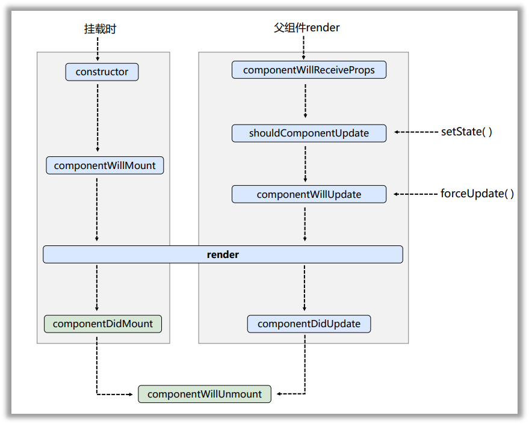
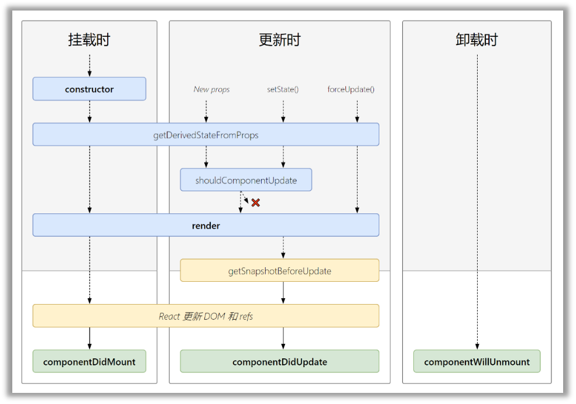

# 组件的生命周期

## 旧的生命周期

1. 初始化阶段: 由 ReactDOM.render()触发---初次渲染
   1. constructor()
   2. componentWillMount()
   3. render()
   4. componentDidMount()
2. 更新阶段: 由组件内部 this.setSate()或父组件重新 render 触发
   1. shouldComponentUpdate()
   2. componentWillUpdate()
   3. render()
   4. componentDidUpdate()
3. 卸载组件: 由 ReactDOM.unmountComponentAtNode()触发
   1. componentWillUnmount()

## 新的生命周期

1. 初始化阶段: 由 ReactDOM.render()触发---初次渲染
   1. constructor()
   2. 
getDerivedStateFromProps

   3. render()
   4. componentDidMount()
2. 更新阶段: 由组件内部 this.setSate()或父组件重新 render 触发
   1. 
getDerivedStateFromProps

   2. shouldComponentUpdate()
   3. render()
   4. 
getSnapshotBeforeUpdate

   5. componentDidUpdate()
3. 卸载组件: 由 ReactDOM.unmountComponentAtNode()触发
   1. componentWillUnmount()

## 重要的勾子

1. render：初始化渲染或更新渲染调用
2. componentDidMount：开启监听, 发送 ajax 请求
3. componentWillUnmount：做一些收尾工作, 如: 清理定时器
