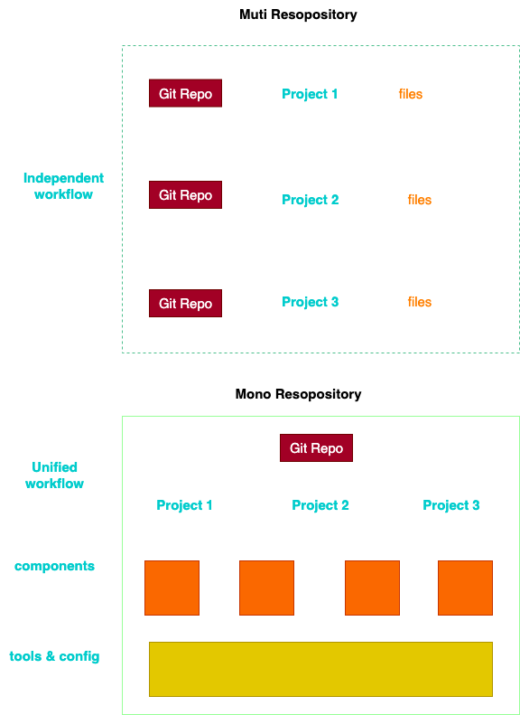

# 组件库工程化

## 是什么

前端的一整套东西覆盖也非常广泛，从开发、规范、测试、lint、构建、部署、监控、集成、微服务等等链路都隶属于前端工程化，所以一看这么长的链路再去考虑如何总结这个问题就显得务虚了，我们需要尽量将其简化，来逐个击破。逐渐完善我们对工程化的认知。

工程化不是一门具体的技术，而是一系列技术的组合，总而言之就是通过一系技术的应用，为你的项目从开发到生产、到迭代各个环节能够顺利产出而服务。是因为不同的项目具体运营到的工程化技术也有所不同，所以每个人项目经验的不同也会影响其对工程化的定义。

::: tip 是什么？
简单来讲：前端工程化指的是:在企业级的前端项目开发中，把前端开发所需的工具、技术、流程、经验等进行规范化、标准化。最终落实到细节上，从而实现前端的4 个现代化:模块化、组件化、规范化、自动化
:::

1. 前端工程化的内容：各种工具和技术
2. 前端工程化的作用：通过使用工具，提升开发效率

## 常见问题

1. 构建配置、打包配置等等涉及项目的配置文件每次新开项目都需要去复制粘贴。
2. 公共工具函数，代码片段、等等复用成本较高，需要自己在不同项目反复寻找已经使用过的东西。
3. 团队公共组件没有办法方便引入，版本升级迭代对不用业务的影响无法评估，组件维护升级提心吊胆。
4. 团队编码风格大相捷径，新拉下的代码一篇爆红，不敢随便更改团队其他成员代码，害怕承担责任，屎山代码越积越大，越积越多。
5. 团队开发环境、 开发编辑器、开发习惯、格式化格式不同，每次格式化变化巨大，`codeReview`代码难度变大。
6. 成员不敢主动让团队其他人`CodeReview`代码，会觉得不好意思，不敢让别人主动指出自己错误，也就导致团队没法定期互相`code review`，诸如此类的流程就很难继续下去。
7. 团队协作的规范、模块、环境、仓库、文档、各类基建轮子过多，新同学进入团队无从下手，不易快速融入团队。
8. 随着需求日益增加复杂，很多小的问题逐渐被放大，项目被迫走上重构的道路！

## `pnpm` 的 `monorepo`

### 什么是 `monorepo`

`Monorepo`其实是一概念，在软件工程领域，它已经有很多年的历史了，所以，他并不是一个新奇的产物，也很好理解，就是把多个项目放在同一个仓库，与之相反的则是`MultiRepo`概率，就是每个单独的项目对应一个仓库来单独管理，相信日常开发中，我们对后者的这种形式更多，毕竟都喜欢从零开发开发项目。

### 🍦 `MultiRepo`的不足

在使用`Monorepo`之前，我们需要了解到`MultiRepo`场景的痛点，在传统项目开发中，每一个项目都是独立的，也就意味着从**环境配置**、**代码复用**、**版本管理**、**项目基建**、**公共类库**等等方面在每一次新开项目的过程中都需要统一管理，这样导致每个项目之间可能存在差异，比如，不同版本的公共类库使用，一处的变更会导致不同的项目都需要同时变更，假设`ci流程`、`配置发布流程`等等这些配置发生变化，多项目意味着每一个项目都需要改变，显然，这样的成本是巨大的，在后续维护中可能会面临更高的成本。

### 🚀 Monorepo有何好处

传统开发的常见问题的反面就是`Monorepo`的好处
以这样的架构去建设的项目，通常所有项目的环境保持统一，减少了项目之间出现不同环境配置差异而带来的难以理解奇怪场景出现。
同时项目基建成本也会降低，所有需要复用的统一配置，比如代码质量检测、代码风格检测、cicd发布部署、这样都会变得更加简单，可以投入更少的开发资源对齐进行维护。
